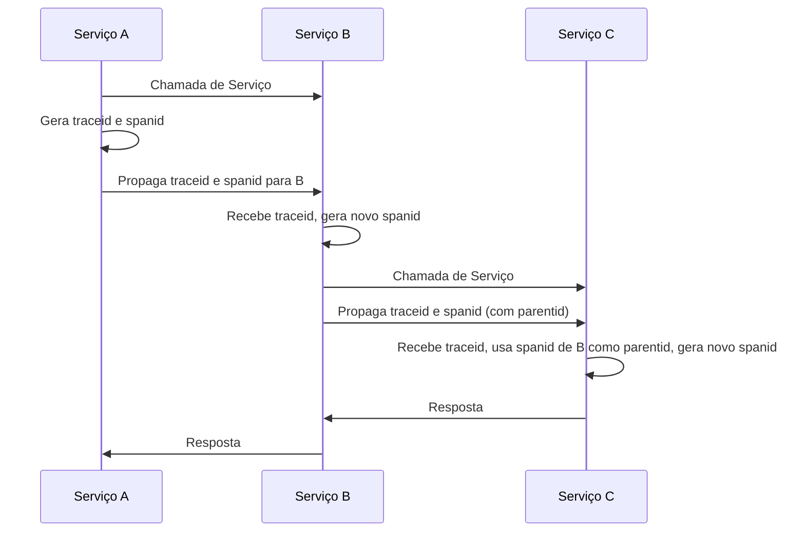

# Monitoramento e Observabilidade

O monitoramento é utilizado há décadas por equipes de TI para obter insights sobre a disponibilidade e performance de sistemas. A observabilidade é uma evolução do monitoramento, que busca entender o comportamento de sistemas complexos.

## O que é Monitoramento?

O monitoramento é a prática que visa coletar dados sobre a disponibilidade e performance de sistemas. Esses dados são utilizados para identificar problemas e tomar decisões baseadas em fatos. O monitoramento tradicional é totalmente reativo, e se concentra em métrica, alerta e dashboards. Dashboard repleta de gráficos, e talvez não sabemos o que todos os gráficos realmente dizem.

Seguindo esse conceito, um sistema monitorado é capaz de produzir respostas para várias perguntas previamente conhecidas. Alguns exemplos de perguntas que podem ser respondidas por um sistema monitorado:

- Como estão os níveis de consumo de recursos computacional (CPU, memória, disco, rede)?
- Qual é a taxa de erro da última hora?
- Qual é o tempo médio de resposta das requisições?
- Existe algum alerta disparado?

Você pode pensar no monitoramento como um semáforo:

- O componente está disponível e saudável? 
  - Verde: tudo está bem.
- O componente está em riso?
  - Amarelo: atenção, algo pode estar errado.
- O componente está em falha?
  - Vermelho: algo está errado.

As repostas para esses questionamentos nos permite determinar o estado atual do sistema, e tomar ações corretivas quando necessário. Essas informações são cruciais em análise de incidentes, troubleshooting e planejamento de capacidade.

## O que é Observabilidade?

A observabilidade nada mais é do que a capacidade de compreender o estado interno de um sistema com base em seu comportamento.
Para um sistema ser considerado minimamente observável é necessário cumprir alguns requisitos, sendo eles: permitir a coleta de logs, métricas, traces distribuídos, eventos e correlacionar esses dados de forma a permitir a identificação de problemas e a tomada de decisões baseadas em fatos.

Conforme essa definição, alguns questionamento que podem surgir em um sistema observável:

- Quais são os impactos de uma mudança em um microsserviços específico?
- Qual motivo esse cliente específico está recebendo erros?
- Quais são os serviços mais lentos em um ambiente de produção?

Os engenheiros que praticam a observabilidade conseguem questionar o sistema fazendo perguntas exploratórias, usando as respostas para conduzir a outras investigações. Tais questionamentos podem ser realizados em diferentes estágios do ciclo de vida do sistema, de acordo com o contexto da situação enfrentada.

## Saiba mais

- [Ezzio Moreira - Observabilidade e Monitoramento](https://dev.to/ezziomoreira/observabilidade-e-monitoramento-1p1a)
- [Qual é a diferença entre um sistema centralizado e um distribuído?](https://www.atlassian.com/br/microservices/microservices-architecture/distributed-architecture)
- [eBook Free - Monitoring - Google SRE Book](https://sre.google/workbook/monitoring/)
- [eBook Free - Distributed Systems Observability](https://unlimited.humio.com/rs/756-LMY-106/images/Distributed-Systems-Observability-eBook.pdf)
- [eBook Observability Engineering](https://info.honeycomb.io/observability-engineering-oreilly-book-2022)
- [Introdução à Observabilidade - OpenTelemetry](https://opentelemetry.io/pt/docs/concepts/observability-primer/)

# Telemetria

Telemetria é um tipo de dado gerado por um sistema. Esse dado é utilizado para monitorar e observar o comportamento de um sistema. Provavelmente você está familiarizado com dois tipos de telemetria: métricas e logs.

## Métricas

Métrica é uma representação numérica de uma característica de um sistema em relação ao tempo. As métricas fornecem uma visão geral da integridade e performance do sistema. 

As métricas também são úteis para escalar o ambiente, planejar capacidade e são mais indicadas para criar alertas e dashboards.


A métrica é composta por um nome da métrica (por exemplo, `http.requests.total`), o registro de data e hora (com precisão em milissegundos), pelo valor da métrica (um valor float64) e tags.

Após a coleta, as métricas apresentam maior flexibilidade para cálculos matemáticos, probabilidade, estatistificas, amostragem, etc.

### Tipos de métricas

A maioria das bibliotecas de métricas suportam os seguintes tipos de métricas:

- **Counter**: Um valor que acumula com o tempo, esse valor só cresce ou pode ser redefinido para zero na reinicialização. São muito utilizadas para contagem de eventos: número de requisições HTTP, número de erros, quantidade de acessos. 

- **Gauge**: Um valor que pode aumentar ou diminuir ao longo do tempo. São muito utilizadas para representar valores instantâneos: uso de CPU, memória, etc.

- **Histogram**: Um contador que fornece a distribuição de valores em um intervalo. São muito utilizadas para medir a distribuição de valores: tempo de resposta de uma requisição entre 0-100ms, 100-200ms, tamanho de arquivos.

### Cardinalidade

Cardinalidade se refere ao número de valores possíveis que uma métrica pode assumir. Métricas com alta cardinalidade podem ser mais difíceis de armazenar e processar.

Muitos sistemas de banco de dados não conseguem lidar com eficiência com o volume de dados gerado por métricas de alta cardinalidade. Por isso, é importante entender a cardinalidade dos dados que você está gerando, coletando e armazenando.

**Alta Cardinalidade**: "Monitorar os números de placa de cada carro no estacionamento." (Muitos valores únicos, um para cada carro).

**Baixa Cardinalidade**: "Contar quantos carros são de cada cor no estacionamento." (Poucos valores únicos, como vermelho, azul, preto).

## Traces

Também conhecido como rastreamento, trace ou tracing, possibilita acompanhar o fluxo e a condição de uma transação. O trace conta a história de uma transação e fornecendo informações sobre o tempo gasto em cada parte do sistema.


A imagem acima representa um trace (rastro), e cada interação nessa requisição é chamada de span (trecho), cada trace e cada span possui um identificador único, são conhecidos como `traceid` e `spanid`, esses valores serve para identificar as interações na transação.

### Propagação de contexto

Para que um trace seja efetivo, é necessário que o contexto seja propagado entre os serviços. A propagação de contexto é o mecanismo que move o `traceid` e `spanid` entre os serviços.



Por exemplo, quando o serviço A chama o serviço B, o `traceid` e `spanid` são propagados para o serviço B. Quando o serviço B chama o serviço C, o `traceid` e o `spanid` de B (com `parentid`) são propagados para o serviço C. Dessa forma, é possível correlacionar as interações entre os serviços.

### Amostragem

A amostragem é uma técnica que permite coletar uma fração dos traces gerados por um sistema. A amostragem é importante para reduzir a quantidade de dados gerados e armazenados, sem perder a capacidade de identificar problemas.

Por exemplo, a grande maioria das requisições de um sistema são bem-sucedidas e terminam com latências baixa, você não precisa armazenar todos os traces, apenas uma fração deles.


Na imagem acima, a amostragem é utilizada para coletar apenas uma fração dos traces gerados pelo sistema. Para sistemas de alto volume é comum utilizar uma taxa de amostragem de 1% ou menos.

A maioria dos sistemas de tracing suportam duas estratégias de amostragem:

- **Head-based sampling**: A decisão de amostragem é tomada no início do trace, e é propagada para todos os spans filhos. Nesse tipo de estratégia não é possível garantir que todos os spans de um trace sejam amostrados.
- **Tail-based sampling**: A decisão de amostragem é tomada no final do trace, e é propagada para todos os spans pais. Nesse tipo de estratégia é possível garantir que todos os spans de um trace sejam amostrados.

## Logs

Log é um registro de evento relevante e imutável gerado por um sistema ao longo do tempo. Os logs são considerados dos elementos fundamentais para qualquer sistema, e todos os registos de log possuem no mínimo 3 características, uma marcação de data e hora do momento que o evento foi gerado, uma mensagem que descreve o acontecimento e uma severidade (INFO, WARN, ERROR, EMERGENCY) que classifica o tipo de evento.

Log são recomendados para registrar eventos de exceção, auditoria, segurança ou para gerar contextos adicionais que não são capturados por outros tipos de telemetria.

```json
{
    "timestamp": "2024-10-06T14:35:00Z",
    "level": "INFO",
    "event": "USER_LOGIN",
    "userId": "12345",
    "username": "ezziomoreira",
    "ipAddress": "192.168.1.10",
    "userAgent": "Mozilla/5.0 (Windows NT 10.0; Win64; x64) AppleWebKit/537.36 (KHTML, like Gecko) Chrome/100.0.4896.75 Safari/537.36",
    "action": "LOGIN_SUCCESS",
    "details": {
        "location": "Fortaleza, Brazil",
        "sessionId": "abc123xyz456"
    },
    "context": {
        "traceId": "5B8EFFF798038103D269B633813FC60C",
        "spanId": "EEE19B7EC3C1B174"
    }
}
```

O exemplo acima é um log de um evento de login de usuário, que contém informações sobre o usuário, evento, IP, navegador, localização, sessão, `traceid` e `spanid`.

## Saiba mais

- [Ezzio Moreira - Três Pilares da Observabilidade](https://dev.to/ezziomoreira/tres-pilares-da-observabilidade-1p6d)
- [Prometheus - Types of metrics](https://prometheus.io/docs/concepts/metric_types/)
- [OpenTelemetry - Metrics](https://opentelemetry.io/pt/docs/concepts/signals/metrics/)
- [Honeycom - Understanding High Cardinality and Its Role in Observability](https://www.honeycomb.io/getting-started/understanding-high-cardinality-role-observability)
- [OpenTelemetry - Tracing](https://opentelemetry.io/pt/docs/concepts/signals/traces/)
- [Honeycom - Ask Miss O11y: Logs vs. Traces](https://www.honeycomb.io/blog/ask-miss-o11y-trace-vs-log)
- [W3C Context Propagation](https://www.w3.org/TR/trace-context/)
- [OpenTelemetry - Context Propagation](https://opentelemetry.io/pt/docs/concepts/context-propagation/)
- [OpenTelemetry - Sampling](https://opentelemetry.io/pt/docs/concepts/sampling/)
- [Logz - The Complete Guide to Sampling in Distributed Tracing](https://logz.io/learn/sampling-in-distributed-tracing-guide/)
- [OpenTelemetry - Logs](https://opentelemetry.io/pt/docs/concepts/signals/logs/)
