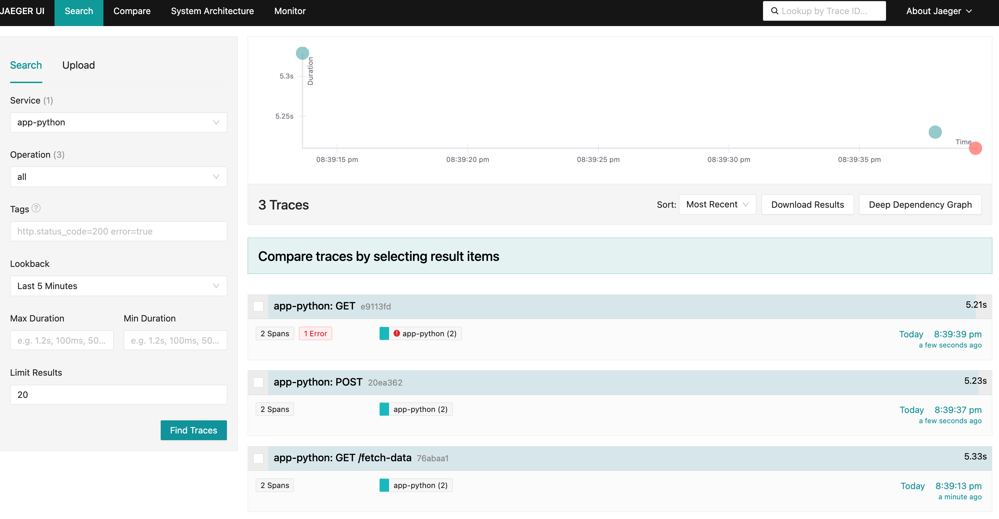

# Prática Módulo 2 - OpenTelemetry

Foco principal deste módulo é explorar a instrumentação sem código e a manual. Vamos utilizar uma aplicação Python de exemplo para demonstrar como é feita a instrumentação e explorar traces no Jaeger.

> Jaeger é um sistema de rastreamento distribuído de código aberto. 

## Requisitos

- [Docker](https://docs.docker.com/get-docker/) 🐳
- [Docker Compose](https://docs.docker.com/compose/install/) 🐳

## Instrumentação Sem Código

Muito conhecido como Auto-Instrumentação, é processo em que o OpenTelemetry modifica o comportamento da aplicação em tempo de execução, adicionando código para gerar, processar e enviar telemetria. Isso é possível graças a uma técnica chamada de [Monkey Patching](https://en.wikipedia.org/wiki/Monkey_patch).

> O método de aplicar instrumentação sem código pode variar de acordo com a linguagem da aplicação.

Com isso, toda vez que uma requisição é feita na aplicação de exemplo o OpenTelemetry captura e envia essas informações para Jaeger.

## Estrutura do Exemplo

A [aplicação Python](app.py) de exemplo é composta por 3 funções que fazem requisições HTTP para um serviço externo [httpbin.org](httpbin.org), implementando uma latência variável entre 1 e 5 segundos.

- Arquivos do Exemplo:
  - `app.py`: Aplicação Python de exemplo.
  - `Dockerfile`: Arquivo de configuração do Docker.
  - `docker-compose.yaml`: Arquivo de configuração do Docker Compose.

### Dockerfile

No Dockerfile, instalamos as dependências da aplicação, copiamos o código fonte `app.py` e configuramos para que, ao iniciar o container, a auto instrumentação seja carregada.

Neste [Dockerfile](./Dockerfile):

- O comando `pip install opentelemetry-distro opentelemetry-exporter-otlp` instala as dependências do OpenTelemetry.
- O comando `opentelemetry-bootstrap -a install` configura a auto instrumentação.
- As variáveis de ambiente configuram o OpenTelemetry para exportar os traces para o Jaeger e defininem atributos de contexto.
  - `OTEL_SERVICE_NAME="app-python"`
  - `OTEL_RESOURCE_ATTRIBUTES="service.version=1.0.0, env=dev"`
  - `OTEL_EXPORTER_OTLP_TRACES_ENDPOINT="http://jaeger:4317"`

## Executando o Exemplo

Agora, siga estes passos para executar a aplicação e visualizar os traces no Jaeger:

1. Clonar o repositório e acessar o diretório do módulo:

   ```bash
    git clone https://github.com/EzzioMoreira/treinamento-opentelemetry.git
    cd treinamento-opentelemetry/docs/Modulo-2\ -\ OpenTelemetry
    ```

2. Iniciar o Jaeger e a aplicação de exemplo:

   ```bash
   docker-compose up
   ```

3. Acesse os endpoints da aplicação para gerar traces:

   - [http://localhost:8080/fetch-data](http://localhost:8080/fetch-data)
   - [http://localhost:8080/submit-data](http://localhost:8080/submit-data)
   - [http://localhost:8080/simulate-error](http://localhost:8080/simulate-error)
   
4. Acesse o Jaeger para visualizar os traces http://localhost:16686.

    Selecione o serviço `python-app` e clique em `Find Traces` para visualizar os traces gerados pelas requisições que você acabou de fazer.

### O Que Esperar?

Quando você acessar o Jaeger, verá os traces das requisições HTTP, junto com a latência e detalhes de cada requisição. Isso permitirá que você veja exatamente quanto tempo cada requisição levou e como elas fluíram pela aplicação.



## Instrumentação Manual

A instrumentação manual é o processo de adicionar código em aplicações para gerar dados de telemetria. A instrumentação manual é feita utilizando APIs e SDKs do OpenTelemetry.

> A instrumentação manual é recomendada para cenários em que a instrumentação sem código não é suficiente. A instrumentação sem código é recomendada quando você não tem acesso ao código da aplicação ou precisa de uma solução rápida. Nada te impede de usar os dois métodos juntos.

### Implementando Instrumentação Manual

1. Primeiro, precisamos instalar as bibliotecas necessárias para adicionar instrumentação. Adicione os seguintes pacotes ao arquivo `requirements.txt`:

   ```txt
   opentelemetry-api
   opentelemetry-sdk
   opentelemetry-exporter-otlp
   ```

2. Para iniciar a instrumentação é necessário iniciar o `TracerProvider` responsável por criar os `Spans`. Um `Span` representa uma unidade ou operação gerada pela aplicação, vários Spans podem ser agrupados em uma `Trace`. A inicialização do `TracerProvider` inclui o `Resources` e `Exporter`.  

    ```python
    from opentelemetry import trace
    from opentelemetry.sdk.trace import TracerProvider
    from opentelemetry.sdk.trace.export import BatchSpanProcessor
    from opentelemetry.exporter.otlp.proto.http.trace_exporter import OTLPSpanExporter

    # Configurar o tracer provider e o exporter
    trace.set_tracer_provider(TracerProvider())
    tracer = trace.get_tracer(__name__)

    # Configurar o exportador OTLP (para Jaeger, Grafana, etc.)
    otlp_exporter = OTLPSpanExporter(endpoint="http://jaeger:4317")
    span_processor = BatchSpanProcessor(otlp_exporter)
    trace.get_tracer_provider().add_span_processor(span_processor)
    ```

3. Agora, podemos adicionar spans nas funções onde desejamos rastrear o fluxo de execução. Use o trecho de código a seguir para adicionar spans na função `fetch_data_from_external_service`.

    ```python
    def fetch_data_from_external_service():
    with tracer.start_as_current_span("fetch_data_from_external_service") as span:
        # Simular uma solicitação HTTP GET para um serviço externo
        response = requests.get("http://httpbin.org/get")
        span.set_attribute("http.status_code", response.status_code)
        sleep(latency)
        return f"GET request to httpbin.org returned {response.status_code}"
    ```