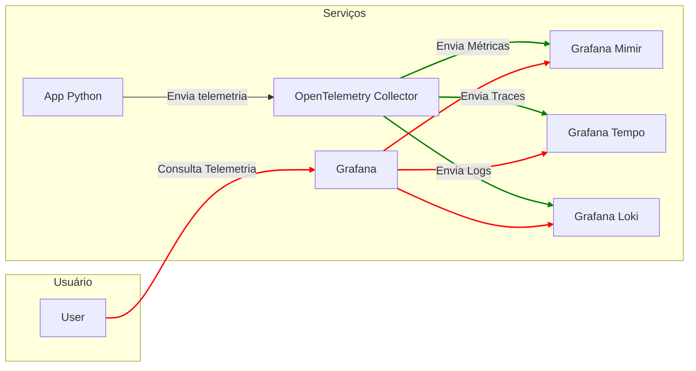

# Instrumentação Sem Código e Manual

O OpenTelemetry oferece duas maneiras de instrumentar aplicações: manualmente e sem código. A instrumentação manual é o processo de adicionar código em aplicações para gerar dados de telemetria. A instrumentação sem código adiciona os recursos da API e SDK do OpenTelemetry em aplicações sem a necessidade de alterar o código fonte.

## Requisitos

- [Docker](https://docs.docker.com/get-docker/) 🐳
- [Docker Compose](https://docs.docker.com/compose/install/) 🐳

## Estrutura do Exemplo

A [aplicação Python](app.py) de exemplo é composta por 3 funções que fazem requisições HTTP para um serviço externo [httpbin.org](httpbin.org), implementando uma latência variável entre 1 e 5 segundos.

- Arquivos do Exemplo:
  - `app.py`: Aplicação Python de exemplo.
  - `Dockerfile`: Arquivo de configuração do Docker.
  - `docker-compose.yaml`: Arquivo de configuração do Docker Compose.
    - `Grafana`: Painel de visualização de telemetria.
    - `Grafana Mimir`: Banco de dados para armazenamento de métricas.
    - `Grafana Tempo`: Banco de dados para armazenamento de traces.
    - `Grafana Loki`: Banco de dados para armazenamento de logs.
    - `OpenTelemetry Collector`: Coleta, processa e exporta dados de telemetria.

## Diagrama de Arquitetura

## Instrumentação Sem Código

- [Instrumentação sem código](instrumentação-sem-código.md) 

## Instrumentação Manual

- [Instrumentação manual](instrumentação-manual.md)
