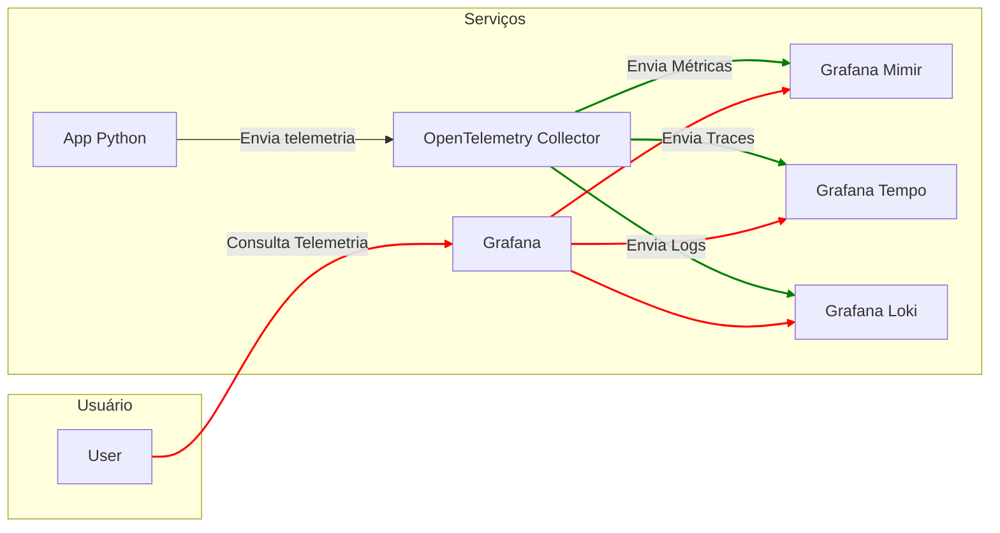

# Instrumentação Sem Código e Manual

O OpenTelemetry oferece duas maneiras de instrumentar aplicações: manualmente e sem código. A instrumentação manual é o processo de adicionar código em aplicações para gerar dados de telemetria. A instrumentação sem código adiciona os recursos da API e SDK do OpenTelemetry em aplicações sem a necessidade de alterar o código fonte.

- 🔗 Link para as instruções de instrumentação: [Instrumentação sem código](instrumentação-sem-código.md)

- 🔗 Link para as instruções de instrumentação: [Instrumentação manual](instrumentação-manual.md)


## Requisitos

- [Docker](https://docs.docker.com/get-docker/) 🐳
- [Docker Compose](https://docs.docker.com/compose/install/) 🐳

## Estrutura do Exemplo

A estrutura do exemplo é composta por uma aplicação Python que consome uma API externa de Pokemon e salva os dados no banco de dados. No decorrer do treinamento, a aplicação será instrumentada com OpenTelemetry para gerar dados de telemetria. Al'ém disso, existem serviços de Grafana, Grafana Mimir, Grafana Tempo e Grafana Loki para visualização dos dados de telemetria.

A aplicação é composta por:

```plaintext
.
├── README.md # Documentação do projeto
├── app.py # Aplicação Python
├── create_db.py # Script para criar o banco de dados
├── database.py # Configuração do banco de dados
├── models.py # Modelos do banco de dados
├── requirements.txt # Dependências do projeto
├── services.py # Serviços da aplicação
└── telemetry.py # Configuração do OpenTelemetry
```

## Diagrama de Arquitetura


