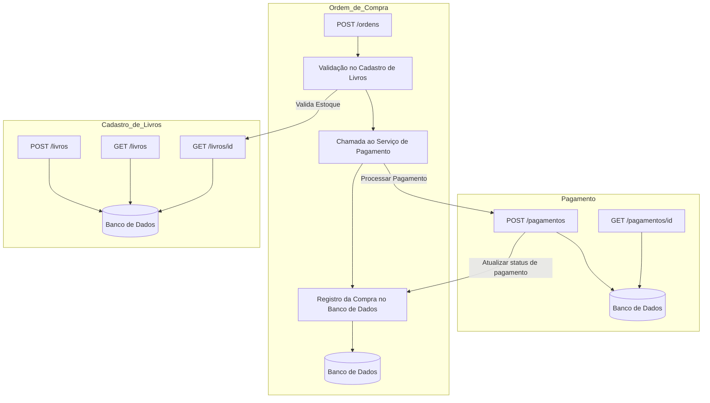
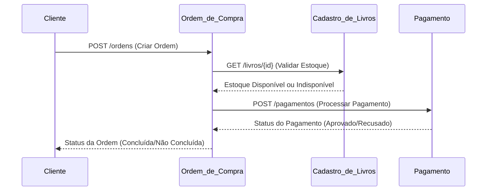
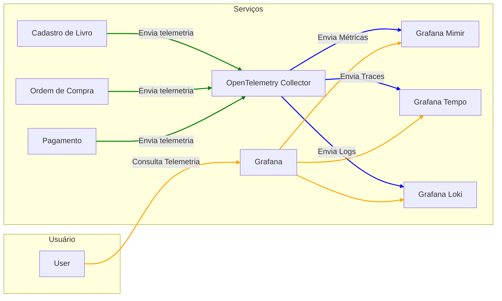

# Instrumentação Com e Sem Código

O OpenTelemetry oferece duas maneiras de instrumentar aplicações: com e sem código. A instrumentação sem código é o processo de adicionar recursos de telemetria em aplicações sem a necessidade de alterar o código fonte. A instrumentação manual é o processo de adicionar código em aplicações para gerar dados de telemetria. 

- 🔗 [Instrumentção Sem Código](./instrumentação-sem-código.md)

## Requisitos

- [Docker](https://docs.docker.com/get-docker/) 🐳
- [Docker Compose](https://docs.docker.com/compose/install/) 🐳

## Sistema Bookstore

Durante o treinamento de OpenTelemetry, vamos utilizar um sistema de exemplo chamado Bookstore. O sistema Bookstore é formado por microserviços que são responsáveis por gerenciar cadastro de livros, ordem de compras e pagamento.

O sistema foi projetado para simular um cenário real de microserviços, proporcionando uma experiência prática para instrumentação de aplicações com OpenTelemetry.

### Microserviços

- Tecnologias Utilizadas
    - Linguagem: Python 3.12
    - Banco de Dados: PostgreSQL

- Cadastro de Livros: Serviço responsável por gerenciar o cadastro de livros.
- Ordem de Compra: Serviço responsável por gerenciar a ordem de compra de livros.
- Pagamento: Serviço responsável por gerenciar o pagamento da ordem de compra.

### Diagrama de Arquitetura

Sistema Bookstore é formado por três microserviços:

```mermaid
graph TD
    subgraph Pagamento
        C1[POST /pagamentos]
        C2[GET /pagamentos/id]
        DB3[(Banco de Dados)]
        C1 --> DB3
        C2 --> DB3
    end

    subgraph Ordem_de_Compra
        A1[POST /ordens] --> A2[Validação no Cadastro de Livros]
        A2 --> A3[Chamada ao Serviço de Pagamento]
        A3 --> A4[Registro da Compra no Banco de Dados]
        DB1[(Banco de Dados)]
        A4 --> DB1
    end

    subgraph Cadastro_de_Livros
        B1[POST /livros]
        B2[GET /livros]
        B3[GET /livros/id]
        DB2[(Banco de Dados)]
        B1 --> DB2
        B2 --> DB2
        B3 --> DB2
    end

    %% Comunicação entre os serviços
    A2 -- "Valida Estoque" --> B3
    A3 -- "Processar Pagamento" --> C1
    C1 -- "Atualizar status de pagamento" --> A4
```

### Diagrama de Sequência

O diagrama de sequência a seguir mostra a interação entre os microserviços do sistema Bookstore:

1. O cliente Inicia o processo de compra.
    - Cliente envia uma requisição para o serviço Ordem_de_Compra para criar uma ordem de compra.
2. Valida Disponibilidade de Estoque.
    - O serviço Ordem_de_Compra valida a disponibilidade de estoque chamando o serviço Cadastro_de_Livros.
3. Processa Pagamento.
    - Após a validação do estoque, o serviço Ordem_de_Compra chama o serviço Pagamento para processar o pagamento.
4. Atualiza Status da Ordem.
    - O serviço Pagamento retorna o status do pagamento para o serviço Ordem_de_Compra, que atualiza o status da ordem de compra.

```mermaid
sequenceDiagram
    participant Cliente
    participant Ordem_de_Compra
    participant Cadastro_de_Livros
    participant Pagamento

    Cliente->>Ordem_de_Compra: POST /ordens (Criar Ordem)
    Ordem_de_Compra->>Cadastro_de_Livros: GET /livros/{id} (Validar Estoque)
    Cadastro_de_Livros-->>Ordem_de_Compra: Estoque Disponível ou Indisponível
    Ordem_de_Compra->>Pagamento: POST /pagamentos (Processar Pagamento)
    Pagamento-->>Ordem_de_Compra: Status do Pagamento (Aprovado/Recusado)
    Ordem_de_Compra-->>Cliente: Status da Ordem (Concluída/Não Concluída)
```

## Diagrama Geral do Sistema e Stack de Observabilidade

O diagrama a seguir mostra a interação entre os microserviços do sistema Bookstore e a stack de observabilidade:

```mermaid
graph LR
    subgraph Usuário
        A[User]
    end

    subgraph Serviços
        B[OpenTelemetry Collector]
        C[Grafana]
        D[Grafana Mimir]
        E[Grafana Tempo]
        F[Grafana Loki]
        G[Cadastro de Livro]
        H[Ordem de Compra]
        I[Pagamento]
    end

    G -->|Envia telemetria| B
    H -->|Envia telemetria| B
    I -->|Envia telemetria| B
    B -- Envia Métricas --> D
    B -- Envia Traces --> E
    B -- Envia Logs --> F
    
    A -- Consulta Telemetria --> C
    C --> D
    C --> E
    C --> F

    %% Estilo das conexões
    linkStyle 0 stroke:green,stroke-width:2px
    linkStyle 1 stroke:green,stroke-width:2px
    linkStyle 2 stroke:green,stroke-width:2px
    linkStyle 3 stroke:blue,stroke-width:2px
    linkStyle 4 stroke:blue,stroke-width:2px
    linkStyle 5 stroke:blue,stroke-width:2px
    linkStyle 6 stroke:orange,stroke-width:2px
    linkStyle 7 stroke:orange,stroke-width:2px
    linkStyle 8 stroke:orange,stroke-width:2px
    linkStyle 9 stroke:orange,stroke-width:2px
```
