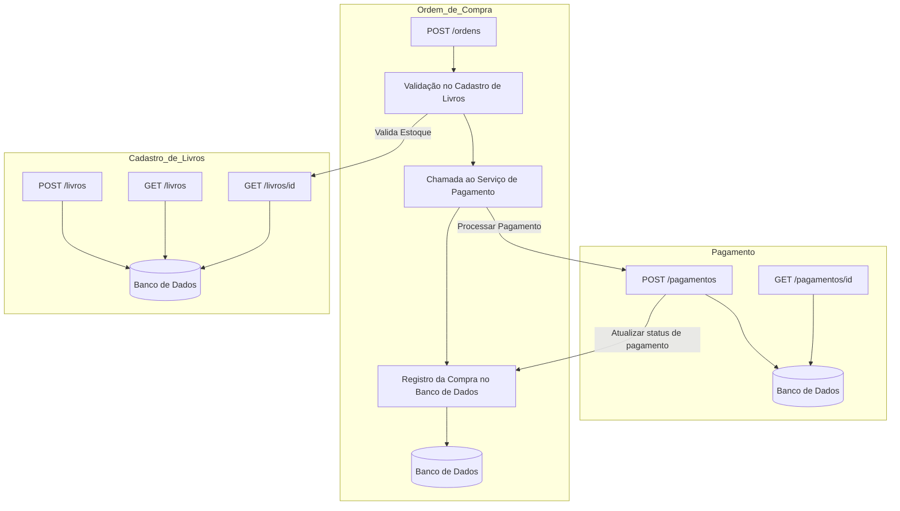
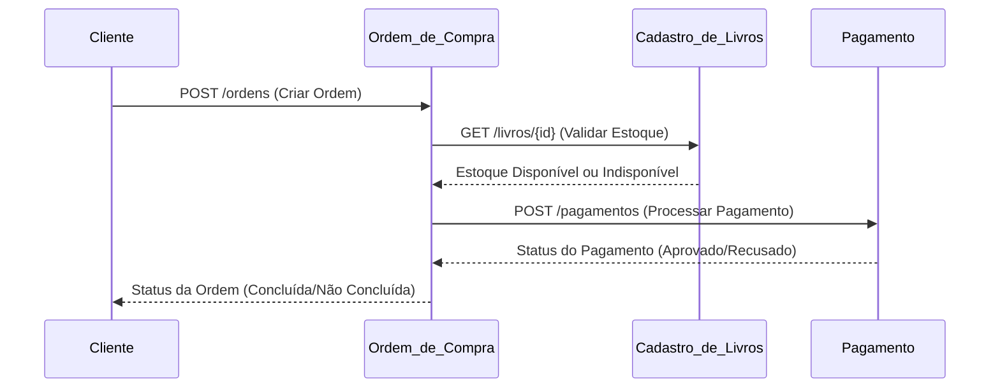

## Sistema Bookstore

Durante o treinamento de OpenTelemetry, vamos utilizar um sistema de exemplo chamado Bookstore. O sistema Bookstore é formado por microserviços que são responsáveis por gerenciar cadastro de livros, ordem de compras e pagamento.

O sistema foi projetado para simular um cenário real de microserviços, proporcionando uma experiência prática para instrumentação de aplicações com OpenTelemetry.

### Microserviços

- Tecnologias Utilizadas
    - Linguagem: Python 3.12
    - Banco de Dados: PostgreSQL

- Cadastro de Livros: Serviço responsável por gerenciar o cadastro de livros.
- Ordem de Compra: Serviço responsável por gerenciar a ordem de compra de livros.
- Pagamento: Serviço responsável por gerenciar o pagamento da ordem de compra.

### Diagrama de Arquitetura

Sistema Bookstore é formado por três microserviços:

### Diagrama de Sequência

O diagrama de sequência a seguir mostra a interação entre os microserviços do sistema Bookstore:

1. O cliente Inicia o processo de compra.
    - Cliente envia uma requisição para o serviço Ordem_de_Compra para criar uma ordem de compra.
2. Valida Disponibilidade de Estoque.
    - O serviço Ordem_de_Compra valida a disponibilidade de estoque chamando o serviço Cadastro_de_Livros.
3. Processa Pagamento.
    - Após a validação do estoque, o serviço Ordem_de_Compra chama o serviço Pagamento para processar o pagamento.
4. Atualiza Status da Ordem.
    - O serviço Pagamento retorna o status do pagamento para o serviço Ordem_de_Compra, que atualiza o status da ordem de compra.

