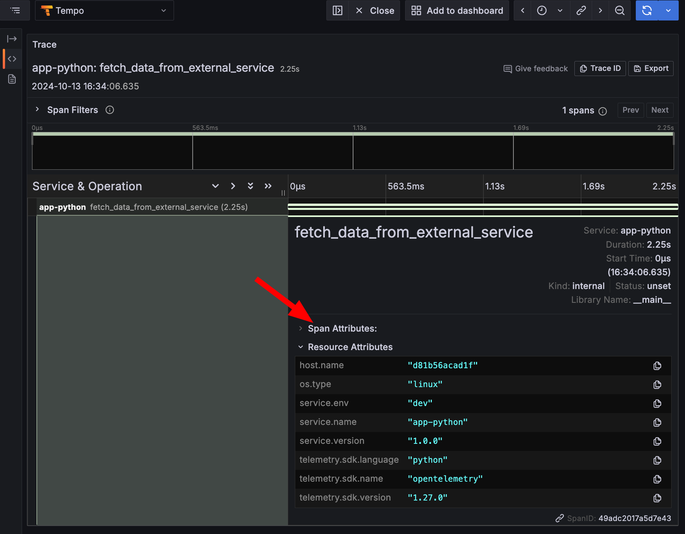
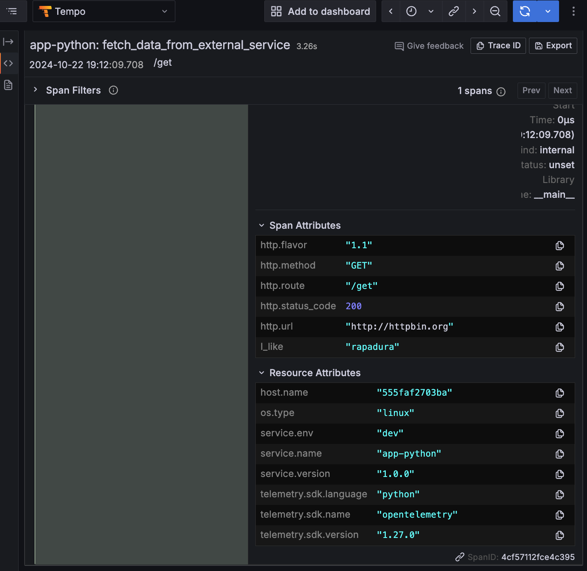

## Instrumentação Manual

A instrumentação manual é o processo de adicionar código em aplicações para gerar dados de telemetria. A instrumentação manual é feita utilizando APIs e SDKs do OpenTelemetry.

> A instrumentação manual é recomendada para cenários em que a instrumentação sem código não é suficiente.

### TracerProvider

1. Clonar o repositório e acessar o diretório do módulo:

   ```bash
    git clone https://github.com/EzzioMoreira/treinamento-opentelemetry.git && cd treinamento-opentelemetry
    ```

1. Primeiro, precisamos instalar as bibliotecas necessárias para adicionar instrumentação. Adicione os seguintes pacotes ao arquivo `app-python/requirements.txt`:

   ```txt
   opentelemetry-api==1.28.2
   opentelemetry-sdk==1.28.2
   opentelemetry-exporter-otlp==1.28.2
   ```

   Os pacotes `opentelemetry-api` e `opentelemetry-sdk` são necessários para adicionar instrumentação na app de exemplo. O pacote `opentelemetry-exporter-otlp` é necessário para exportar os dados de telemetria para o OpenTelemetry Collector. 

1. Para iniciar a instrumentação, é necessário instanciar o `TracerProvider`, responsável por gerenciar `Traces` e `Spans`. Diversos Spans agrupados formam um Trace. A configuração inicial também inclui as classes `OTLPSpanExporter` e `BatchSpanProcessor` para configurar o Trace Provider. 

    Para deixar a estrutura mais organizada, crie um arquivo `traces.py` no diretório `app-python` e adicione o seguinte trecho de código:

    ```python
    """
    Modulo para configurar o rastreamento de spans com OpenTelemetry.
    """
    import os
    from opentelemetry import trace
    from opentelemetry.sdk.trace import TracerProvider
    from opentelemetry.sdk.trace.export import BatchSpanProcessor
    from opentelemetry.exporter.otlp.proto.grpc.trace_exporter import OTLPSpanExporter
    from opentelemetry.sdk.resources import Resource


    def setup_tracing():
        """
        Configura e retorna o TracerProvider para rastreamento.
        """
        # Obtém atributos de recurso da variável de ambiente ou define padrões
        resource_attributes = os.environ.get("OTEL_RESOURCE_ATTRIBUTES") or "service.name=app-python,service.version=0.1.0,service.env=dev"
        key_value_pairs = resource_attributes.split(',')
        result_dict = {}

        # Converte atributos no formato chave=valor para um dicionário
        for pair in key_value_pairs:
            key, value = pair.split('=')
            result_dict[key.strip()] = value.strip()

        # Define atributos de recurso
        resource_attributes = {
            "service.name": result_dict.get("service.name", "app-python"),
            "service.version": result_dict.get("service.version", "0.1.0"),
            "service.env": result_dict.get("service.env", "dev")
        }

        resource = Resource.create(resource_attributes)

        # Configura o exportador OTLP
        provider = TracerProvider(resource=resource)
        processor = BatchSpanProcessor(OTLPSpanExporter(insecure=True))
        provider.add_span_processor(processor)

        # Registra o TracerProvider como padrão
        trace.set_tracer_provider(provider)

        # Retorna um tracer configurado
        return trace.get_tracer(__name__)


    # Configura e cria o tracer ao importar o módulo
    tracer = setup_tracing()
    ```
    
    Iniciamos definindo uma lógica para obter os atributos de recurso da variável de ambiente `OTEL_RESOURCE_ATTRIBUTES`. Em seguida, convertemos os atributos em um dicionário para facilitar o acesso. Caso a variável de ambiente não seja definida, usamos valores padrão para os atributos de recurso.

    Em seguida, instanciamos um `TracerProvider` e um `BatchSpanProcessor` para configurar o exportador OTLP. O exportador OTLP é responsável por enviar os dados de telemetria para o OpenTelemetry Collector. Por fim, registramos o `TracerProvider` como padrão e retornamos um `Tracer` configurado.

    Com a pipeline de rastreamento configurada, podemos obter um Tracer. A interface do `TraceProvider` define um método `get_tracer` que nos permite obter um `Tracer`.

## Adicionando Spans

1. Agora, podemos adicionar spans nas funções onde desejamos rastrear o fluxo de execução. Vamos iniciar adicionando spans na rota `/pokemon/fetch/<name>`. O código de exemplo está estruturado em responsabilidades separadas, com a lógica de negócios em `services.py` e a lógica de roteamento em `app.py` por fim a logica de acesso a base de dados em `models.py`.

    Primeiro será necessário importar o `Tracer` do módulo `traces.py`. Adiciona o seguinte trecho de código ao arquivo `app.py`:

    ```python
    # app.py
    from traces import tracer
    ```

    Em seguida podemos adicionar spans nas funções que desejamos rastrear. Adicione o seguinte trecho de código ao arquivo `app.py`:

    ```python
    # app.py
    @app.get("/pokemon/fetch/<name>")
        with tracer.start_as_current_span("fetch_pokemon") as span:  
            def fetch_pokemon(name):
            logger.info(f"Fetching data for Pokemon: {name}")
            response, status_code = fetch_pokemon_data(name)
            return jsonify(response), status_code
    ```

    ```python
    # services.py
    def fetch_pokemon_data(name):
    url = f"https://pokeapi.co/api/v2/pokemon/{name.lower()}"
    try:
        response = requests.get(url)
        response.raise_for_status()
        data = response.json()
        pokemon_data = {
            "name": data.get("name"),
            "height": data.get("height"),
            "weight": data.get("weight"),
            "abilities": [ability["ability"]["name"] for ability in data.get("abilities", [])],
            "types": [type_data["type"]["name"] for type_data in data.get("types", [])]
        }
        save_pokemon(pokemon_data)
        return pokemon_data, 200
    except requests.exceptions.RequestException as e:
        logger.error(f"Error fetching Pokemon data: {e}")
        return None
    ```

    Quando definimos `start_as_current_span`, estamos criando um novo span e definindo-o como o span ativo. Isso significa que qualquer operação que ocorra dentro do bloco `with` será associada a esse span.

    Uma vez que a função retorna o resultado da solicitação, o método `end` é chamado para finalizar o span. É uma boa prática chamar o método `end` para garantir que o span seja finalizado corretamente.

1. Definia as variáveis de ambiente necessárias para configurar o `OTLPSpanExporter`. Adicione o seguinte trecho de código ao arquivo `docker-compose.yaml`:

    ```yaml
    environment:
      - OTEL_SERVICE_NAME=app-python
      - OTEL_RESOURCE_ATTRIBUTES=service.name=app-python, service.version=1.0.0, service.env=dev
      - OTEL_EXPORTER_OTLP_ENDPOINT=http://otelcollector:4317
      - OTEL_EXPORTER_OTLP_INSECURE=true
      - OTEL_PYTHON_LOG_CORRELATION=true
    ```

    - Em seguida, execute o comando `docker-compose up` para iniciar a aplicação.

    ```shell
    docker-compose up
    ```

    - Acessar os endpoints da aplicação para gerar traces: [http://localhost:8080/fetch-data](http://localhost:8080/fetch-data) em seguida, acesse o Grafana para visualizar a telemetria gerada [http://localhost:3000](http://localhost:3000).

    Perceba que no Trace não há informações no Span Attributes, isso ocorre porque não definimos nenhum atributo no Span. Chegaremos nesse ponto mais adiante.

    

## Adicionando Atributos ao Span

1. Vamos enriquecer o Trace adicionando atributos ao Span. Usaremos [Atributos Semânticos](https://opentelemetry.io/docs/specs/semconv/general/trace/) que permite a normalização dessas informações. Primeiro é necessário instalar o pacote `opentelemetry-semantic-conventions`, adicione o pacote ao arquivo `requirements.txt`:

    ```txt
    ...
    opentelemetry-semantic-conventions
    ...
    ```

    - Em seguida, importe o pacote:

    ```python
    from opentelemetry.semconv.trace import SpanAttributes
    ```

    - Adicione os atributos ao Span:

    ```python
    def fetch_data_from_external_service():
        def fetch_data_from_external_service():
        with tracer.start_as_current_span("fetch_data_from_external_service") as span:
            # Simula uma solicitação HTTP GET para um serviço externo
            response = requests.get("http://httpbin.org/get")
            # Adiciona atributos ao Span
            span.set_attribute(SpanAttributes.HTTP_METHOD, "GET")
            span.set_attribute(SpanAttributes.HTTP_FLAVOR, "1.1")
            span.set_attribute(SpanAttributes.HTTP_ROUTE, "/get")
            span.set_attribute(SpanAttributes.HTTP_URL, "http://httpbin.org")
            span.set_attribute(SpanAttributes.HTTP_STATUS_CODE, response.status_code)
            span.add_attribute("I_like", "rapadura")
            sleep(latency)
            logging.info(f"GET request to httpbin.org returned {response.status_code}")
            return f"GET request to httpbin.org returned {response.status_code}"
            span.end()
    ```

    Atributos são pares de chave-valor que fornecem informações adicionais sobre o span. Eles são úteis para adicionar metadados que podem ser usados para filtrar, pesquisar e analisar spans. Por exemplo, se uma operação da aplicação onde um item é adicionado ao carrinho, você pode capturar os atributo `item_id`, `item_name`, `item_price`, `cliente_id`, etc. Essas informações podem ser usadas para analisar o comportamento do usuário, identificar problemas e muito mais.

    - Execute novamente a aplicação e acesse o endpoint [http://localhost:8080/fetch-data](http://localhost:8080/fetch-data) para gerar traces.

    - Acesse o Grafana para visualizar a telemetria gerada [http://localhost:3000](http://localhost:3000).

    Note que no Trace agora temos informações no Span Attributes.

    

## Adicionando Eventos ao Span

1. Eventos são registros que ocorrem durante a execução de um span. São úteis para registrar informações adicionais sobre o span, como logs, exceções, mensagens de depuração, etc. 

    Adicione o seguinte trecho de código ao arquivo `app.py`:

    ```python
    def fetch_data_from_external_service():
        with tracer.start_as_current_span("fetch_data_from_external_service") as span:
            # Simula uma solicitação HTTP GET para um serviço externo
            response = requests.get("http://httpbin.org/get")
            span.set_attribute(SpanAttributes.HTTP_METHOD, "GET")
            span.set_attribute(SpanAttributes.HTTP_FLAVOR, "1.1")
            span.set_attribute(SpanAttributes.HTTP_ROUTE, "/get")
            span.set_attribute(SpanAttributes.HTTP_URL, "http://httpbin.org")
            span.set_attribute(SpanAttributes.HTTP_STATUS_CODE, response.status_code)
            span.set_attribute("I_like", "rapadura")
            span.add_event("a operação foi realizada com sucesso com:", {
                "status_code": str(response.status_code),
                "request_headers": str(response.request.headers),
            })
            sleep(latency)
            logging.info(f"GET request to httpbin.org returned {response.status_code}")
            return f"GET request to httpbin.org returned {response.status_code}"
            span.end()
    ```
    
    O método `add_event` só aceitam valores de tipo string. Considere usar eventos para registrar pontos significativos no ciclo de vida de um span. Por exemplo, você pode registrar eventos para indicar quando uma operação foi iniciada, quando uma operação foi concluída, quando ocorreu um erro.

    - Execute novamente a aplicação e acesse o endpoint [http://localhost:8080/fetch-data](http://localhost:8080/fetch-data) para gerar traces.

    - Acesse o Grafana para visualizar a telemetria gerada [http://localhost:3000](http://localhost:3000).

    Note que no Trace agora temos informações no Span Events.

    

## Adicionando Links ao Span

1. Links são referências a outros spans. Links são úteis para correlacionar spans e rastrear o fluxo de execução. Por exemplo, você pode adicionar links para indicar que um span é filho de outro span, ou que um span é relacionado a outro span.