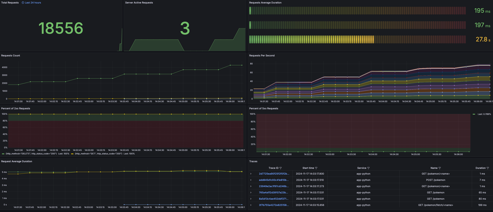

## Instrumentação Sem Código

Também conhecido como Auto-Instrumentação, é o processo em que o OpenTelemetry modifica o comportamento da aplicação em tempo de execução, adicionando código para gerar, processar e enviar telemetria. Isso é possível graças a uma técnica chamada de [Monkey Patching](https://en.wikipedia.org/wiki/Monkey_patch), amplamente utilizada em linguagens como Python, Ruby e JavaScript.

> O método de aplicar instrumentação sem código varia de acordo com a linguagem de programação.

Através do processo de instrumentação sem código, toda vez que uma requisição é feita na aplicação de exemplo, o OpenTelemetry captura e envia a telemetria para o OpenTelemetry Collector, que por sua vez, envia para o Grafana.

Instrumentação sem código é um bom começo para iniciar sua jornada com instrumentação de aplicações, mas é importante lembrar que a instrumentação sem código não é suficiente para todos os cenários. Em alguns casos, você precisará adicionar código manualmente para instrumentar corretamente a aplicação. 

## Implementando Instrumentação Sem Código

Agora, siga estes passos para implementar a instrumentação sem código na aplicação Python de exemplo:

1. Clonar o repositório e acessar o diretório do módulo:

   ```bash
    git clone https://github.com/EzzioMoreira/treinamento-opentelemetry.git && cd treinamento-opentelemetry
    ```

1. Para implementar a instrumentação sem código, adicione o seguinte trecho de código ao arquivo [Dockerfile](../../book_store/cadastro_de_livros/Dockerfile) do microserviço `Cadastro de Livro`.

    > Existe um comentário no arquivo `Dockerfile` que indica onde adicionar o trecho de código.

    ```Dockerfile
    RUN pip install opentelemetry-distro opentelemetry-exporter-otlp && \
    opentelemetry-bootstrap
    ```

    Devemos instalar o [pacote distro](https://opentelemetry.io/docs/languages/python/distro/) para que a instrumentação sem código funcione corretamente. O `opentelemetry-distro` contém as distros padrões para configurar automaticamente as opções mais comuns para os usuários, como o SDK TraceProvider, um BatchSpanProcessor e um ConsoleSpanExporter. O `opentelemetry-exporter-otlp` é um exportador que envia os dados de telemetria para o OpenTelemetry Collector. 
    
    O [opentelemetry-bootstrap](https://github.com/open-telemetry/opentelemetry-python-contrib/tree/main/opentelemetry-instrumentation#opentelemetry-bootstrap) faz a leitura dos pacotes instalados na aplicação e instala as bibliotecas necessárias para instrumentar a aplicação. Por exemplo, estamos utilizando o pacote `Flask` na aplicação de exemplo, o `opentelemetry-bootstrap` instalará o pacote `opentelemetry-instrumentation-flask` para nós.

    A lista completa de pacotes de instrumentação padrão e detectáveis está definida [aqui](https://github.com/open-telemetry/opentelemetry-python-contrib/blob/main/opentelemetry-instrumentation/src/opentelemetry/instrumentation/bootstrap_gen.py).

1. No `entrypoint` do [Dockerfile](../../book_store/cadastro_de_livros/Dockerfile) do microserviço `Cadastro de Livro`, adicione o prefixo `opentelemetry-instrument` ao comando de execução da aplicação. 

    > Existe um comentário no arquivo `Dockerfile` que indica onde adicionar o trecho de código.

    ```Dockerfile
    ENTRYPOINT ["opentelemetry-instrument", "python", "-m", "app.main"]
    ```

    O comando [opentelemetry-instrument](https://github.com/open-telemetry/opentelemetry-python-contrib/tree/main/opentelemetry-instrumentation#opentelemetry-instrument) tentará detectar automaticamente os pacotes usados na aplicação e, quando possível, aplicará a instrumentação. O comando suporta configurações adicionais, como a definição de um `tracer_exporter`, `metrics_exporter` entre outros, veja o exemplo.

    ```shell
    opentelemetry-instrument \
    --traces_exporter console,otlp \
    --metrics_exporter console \
    --service_name your-service-name \
    --exporter_otlp_endpoint ip-otel-collector:4317 \
    python myapp.py
    ```

    Como alternativa, vamos utilizar variáveis de ambiente para configurar o `opentelemetry-instrument`. Para isso, adicione o seguinte trecho de código ao arquivo [docker-compose.yaml](../../docker-compose.yaml) no microserviço `Cadastro de Livro`.

    > Existe um comentário no arquivo `docker-compose.yaml` que indica onde adicionar o trecho de código.

    ```yaml
    - OTEL_SERVICE_NAME=cadastro-de-livros
    - OTEL_RESOURCE_ATTRIBUTES=service.name=cadastro-de-livros,service.version=1.0.0,service.env=dev
    - OTEL_EXPORTER_OTLP_ENDPOINT=http://otelcollector:4317
    - OTEL_EXPORTER_OTLP_INSECURE=true
    - OTEL_PYTHON_LOG_CORRELATION=true
    ```

    Estamos configurando o `OTEL_SERVICE_NAME` com o nome do serviço, `OTEL_RESOURCE_ATTRIBUTES` com os atributos do serviço, `OTEL_EXPORTER_OTLP_ENDPOINT` com o endpoint do OpenTelemetry Collector, `OTEL_EXPORTER_OTLP_INSECURE` para permitir conexões inseguras e `OTEL_PYTHON_LOG_CORRELATION` para correlacionar os logs com as traces.

1. Pronto! Agora, basta executar o comando `docker-compose up` para iniciar a aplicação.

    ```shell
    docker-compose up -d
    ```

1. Acesse os endpoints da aplicação para gerar dados de telemetria:

    Ao acessar o endpoint, a aplicação irá listar todos os livros cadastrados.

    ```shell
    curl http://localhost:8080/livros
    ```

    Ao acessar o endpoint, a aplicação irá adicionar um novo livro ao banco de dados.

    ```shell
    curl -X POST http://localhost:8080/livros -H "Content-Type: application/json" -d '{"titulo": "Livro Exemplo", "autor": "Autor Exemplo", "ano": 2023}'
    ```

    Ao acessar o endpoint, a aplicação irá buscar os detalhes de um livro específico pelo ID.

    ```shell
    curl http://localhost:8080/livros/<id>
    ```

    Ao acessar o endpoint, a aplicação irá atualizar os detalhes de um livro específico pelo ID.

    ```shell
    curl -X PUT http://localhost:8080/livros/<id> -H "Content-Type: application/json" -d '{"titulo": "Livro Atualizado", "autor": "Autor Atualizado", "ano": 2024}'
    ```

    Ao acessar o endpoint, a aplicação irá deletar um livro específico pelo ID.

    ```shell
    curl -X DELETE http://localhost:8080/livros/<id>
    ```

1. Acesse o Grafana para visualizar a telemetria gerada em http://localhost:3000.

    No menu `explorer` do Grafana, você pode visualizar as métricas e traces. Selecione `service.name` = `cadastro-de-livros` para visualizar as métricas e traces.

### O Que Esperar?

Quando você acessar os endpoints da aplicação, o OpenTelemetry irá capturar as requisições e enviar para o OpenTelemetry Collector. O OpenTelemetry Collector irá processar e enviar a telemetria para Tempo, Mimir e Loki. Por fim, você poderá visualizar a telemetria no Grafana.

### Gerando Tráfego na Aplicação

1. Vamos utilizar o Grafana K6 para gerar tráfego na aplicação. Para isso, siga os passos:

    Adicione o seguinte trecho de código ao arquivo `docker-compose.yaml`:

    > Existe um comentário no arquivo `docker-compose.yaml` que indica onde adicionar o trecho de código.

    ```yaml
    k6:
      image: grafana/k6:latest
      depends_on:
        - app
      entrypoint: [ "k6", "run", "/scripts/script.js" ]
      volumes:
        - ./config/grafana/k6_generate_traffic.js:/scripts/script.js
      networks:
        - otel
    ```

    O script `k6_generate_traffic.js` é responsável por gerar tráfego na aplicação durante 10 minutos. O script irá acessar os endpoints da aplicação a cada 5 segundos.

1. Agora, execute o comando `docker-compose up` para iniciar a aplicação.

    ```shell
    docker-compose up
    ```

1. Acesse a dashboard App Python no Grafana para visualizar a telemetria gerada [Dashboard App Python](http://localhost:3000/d/flask-monitoring/app-python?orgId=1&refresh=5s).

  A dashboard App Python contém as métricas e traces geradas pela aplicação Python.

  

## Conclusão

Neste módulo, você aprendeu como implementar a instrumentação sem código em uma aplicação Python. A instrumentação sem código é uma maneira fácil e rápida de adicionar telemetria em aplicações sem a necessidade de alterar o código fonte.

## Saiba Mais

- [OpenTelemetry Python](https://opentelemetry.io/docs/zero-code/)
- [Byte Buddy](https://bytebuddy.net/#/)
- [Monkey Patching](https://en.wikipedia.org/wiki/Monkey_patch)
