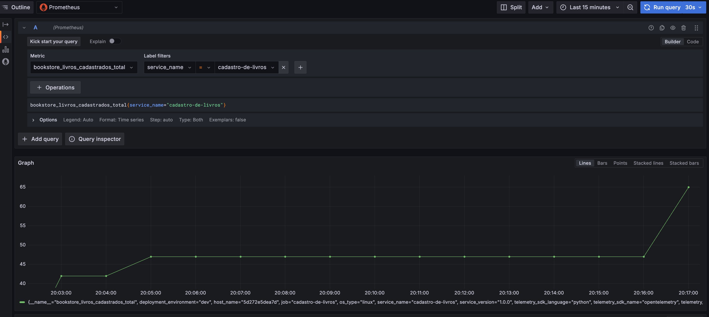

## Criando Métricas

Antes de começar a criar métricas do sistema Bookstore, precisamos entender quais são os tipos de instrumentos do OpenTelemetry:

- **Counter**: Um valor que acumula com o tempo, esse valor só cresce ou pode ser redefinido para zero na reinicialização. São muito utilizadas para contagem de eventos: número de requisições HTTP, número de erros, quantidade de acessos. 

- **Gauge**: Um valor que pode aumentar ou diminuir ao longo do tempo. São muito utilizadas para representar valores instantâneos: uso de CPU, memória, etc.

- **Histogram**: Um contador que fornece a distribuição de valores em um intervalo. São muito utilizadas para medir a distribuição de valores: tempo de resposta de uma requisição entre 0-100ms, 100-200ms, tamanho de arquivos.

### Cardinalidade

Cardinalidade se refere ao número de valores possíveis que uma métrica pode assumir. Métricas com alta cardinalidade podem ser mais difíceis de armazenar e processar.

Muitos sistemas de banco de dados não conseguem lidar com eficiência com o volume de dados gerado por métricas de alta cardinalidade. Por isso, é importante entender a cardinalidade dos dados que você está gerando, coletando e armazenando.

**Alta Cardinalidade**: "Monitorar os números de placa de cada carro no estacionamento." (Muitos valores únicos, um para cada carro).

**Baixa Cardinalidade**: "Contar quantos carros são de cada cor no estacionamento." (Poucos valores únicos, como vermelho, azul, preto).

### Instrumentando o código

1. Adicione os seguintes pacotes ao arquivo [`requirements.txt`](../../book_store/cadastro_de_livros/requirements.txt) do serviço Cadastro de Livros:

    ```txt
    opentelemetry-api==1.28.2
    opentelemetry-sdk==1.28.2
    opentelemetry-exporter-otlp==1.28.2
    ```

    - `opentelemetry-api`: contém a interface para instrumentar o código.
    - `opentelemetry-sdk`: é a implementação da API do OpenTelemetry.
    - `opentelemetry-exporter-otlp`: é responsável por enviar as métricas para o OpenTelemetry Collector.

1. Para criar métricas no OpenTelemetry, você precisa de um `Meter` que é responsável por criar e gerenciar métricas. Vamos iniciar a criação das métricas no serviço de Cadastro de Livros. Para deixar a estrutura do projeto mais organizado, crie um arquivo chamado `metrics.py` no diretório apps do serviço [Cadastro de Livros](../../book_store/cadastro_de_livros/app/).
    
    Crie um arquivo chamado `metrics.py` no diretório `app` da aplicação Cadastro de Livros.

    ```python
    # metrics.py
    """
    Módulo para configurar o MeterProvider do OpenTelemetry
    """
    from opentelemetry import metrics
    from opentelemetry.sdk.resources import Resource
    from opentelemetry.sdk.metrics import MeterProvider
    from opentelemetry.sdk.metrics.export import PeriodicExportingMetricReader  # Importante!
    from opentelemetry.exporter.otlp.proto.http.metric_exporter import OTLPMetricExporter

    def configure_meter():
        """
        Configura medidor com OpenTelemetry.
        """
        # Configura o exportador de métricas (correção da porta)
        exporter = OTLPMetricExporter(
            endpoint="http://otelcollector:4318/v1/metrics",               
        )

        # Cria o leitor para exportação periódica (ex: a cada 10 segundos)
        reader = PeriodicExportingMetricReader(exporter)

        # Define os atributos do recurso
        resource = Resource.create({
            "service.name": "cadastro-de-livros",
            "service.version": "1.0.0",
            "deployment.environment": "dev",
        })

        # Cria o provedor de métricas com o leitor
        provider = MeterProvider(
            resource=resource,
            metric_readers=[reader]  # Adiciona o leitor ao provider
        )
        metrics.set_meter_provider(provider)

        # Retorna o medidor para criar métricas
        return metrics.get_meter(__name__)
    ```

1. A primeira métrica que vamos criar é um counter para contar a quantidade de livros cadastrados. No arquivo [metrics.py](../../book_store/cadastro_de_livros/app/metrics.py) crie a definição da métrica `total_livros`.

    ```python
    """
    Definição das métricas do sistema cadastrador de livros
    """
    livros_cadastrados = configure_meter().create_counter(
        "bookstore.livros.cadastrados",
        description="Total de livros cadastrados",
    )
    ```

    - bookstore.livros.cadastrados: é o nome da métrica, é uma boa prática usar um `namespace` para as métricas. Neste caso, `bookstore` é o namespace, `livros.cadastrados` é o nome da métrica.
    - create_counter: cria um contador
    - description: é a descrição da métrica.

1. Agora, vamos incrementar o contador `bookstore.livros.cadastrados` toda vez que um livro for cadastrado. No arquivo [`models.py`](../../book_store/cadastro_de_livros/app/models.py) do serviço Cadastro de Livros, adicione o código abaixo:

    Importa a métrica `livros_cadastrados` do arquivo `metrics.py`.
    ```python
    # models.py
    from .metrics import livros_cadastrados
    ```

    Incrementa o contador `livros_cadastrados` toda vez que um livro for cadastrado.
    ```python
    # models.py
    # Função que cria um livro no banco de dados
    def cria_livro(db: Session, livro: LivroBase):
        """
        Função que cria um livro no banco de dados
        """
        try:
            db_livro = Livros(titulo=livro.titulo, estoque=livro.estoque)
            db.add(db_livro)
            db.commit()
            db.refresh(db_livro)

            # Incrementa a métrica total_livros_cadastrados
            livros_cadastrados.add(1)
            
            return db_livro
        except Exception as e:
            logger.error(f"Erro ao criar livro no banco de dados: {e}")
        raise
    ```

    Em seguida, execute o comando `docker compose up --build cadastro_de_livros` para construir e iniciar o serviço `cadastro_de_livros`.

    ```shell
    docker compose up --build cadastro_de_livros
    ```

    - Acesse o endpoint [http://localhost:8080/docs](http://localhost:8080/docs) cadastre alguns livros.
    - Acesse o Grafana para visualizar a telemetria gerada [http://localhost:3000](http://localhost:3000).

    Note que a métrica `bookstore_livros_cadastrados_total` contém o valor da quantidade de livros cadastrados.

    

1. Agora, vamos criar uma métrica do tipo `histogram` que mede o duração que um pagamento é processado. No diretório `app` do sistema [pagamento](../../) crie um arquivo chamado `metrics.py` no diretório apps do serviço