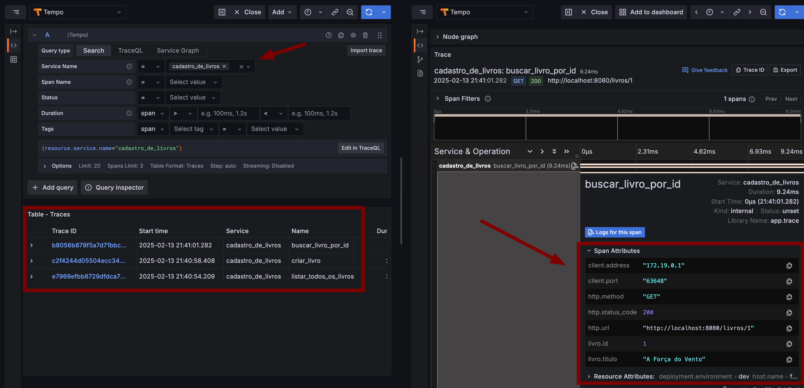
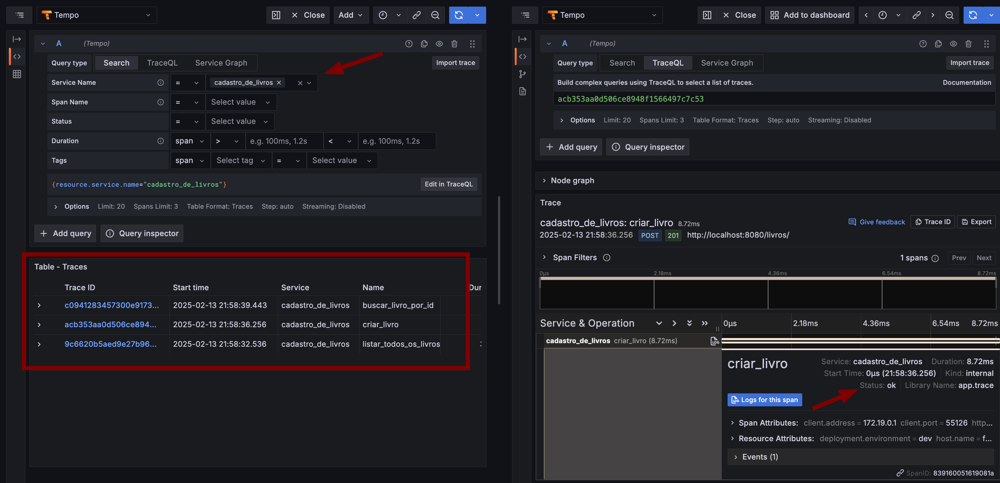
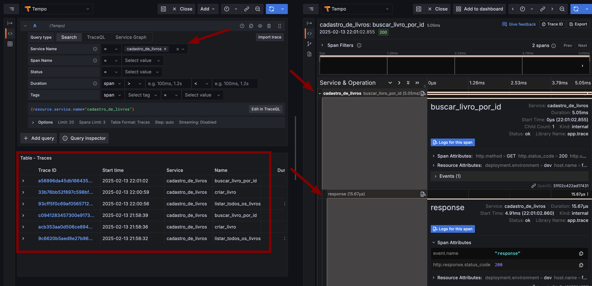

## Instrumentação Manual

A instrumentação manual é o processo de adicionar código no código da aplicações para gerar dados de telemetria. A instrumentação manual é feita utilizando APIs e SDKs do OpenTelemetry.

> A instrumentação manual é recomendada para cenários em que a instrumentação sem código não é suficiente ou você deseja ter mais controle sobre o processo de instrumentação.

## Pré-requisitos

Antes de começar remova a instrumentação sem código do projeto, remova as bibliotecas OpenTelemetry do arquivo `requirements.txt` e remova as linhas `RUN opentelemetry-bootstrap -a install` e `opentelemetry-instrument` do arquivo `Dockerfile` dos microserviços e crie uma nova branch a partir da branch `main` para adicionar a instrumentação com código.

```shell
git checkout main
git ceckout -b feat/instrumentacao-manual
```

### Crianção de Trace

1. Vamos iniciar instrumentando a aplicação [Cadastro de Livro](../../book_store/cadastro_de_livros/). Para adicionar instrumentação manual, é necessário instalar os pacotes do OpenTelemetry.

    Adicione os seguintes pacotes ao arquivo [requirements.txt](../book_store/cadastro_de_livros/requirements.txt):

    ```txt
    opentelemetry-api==1.28.2
    opentelemetry-sdk==1.28.2
    opentelemetry-exporter-otlp==1.28.2
    opentelemetry-instrumentation-sqlalchemy==0.49b2
    ```

    Os pacotes listados acima são necessários para configurar a instrumentação manual. O pacote `opentelemetry-api` contém a API do OpenTelemetry, que é uma interface para a instrumentação. O pacote `opentelemetry-sdk` contém a implementação da API para iniciar a instrumentação. O pacote `opentelemetry-exporter-otlp` contém o exportador OTLP, que é responsável por enviar os dados de telemetria para o OpenTelemetry Collector. O pacote `opentelemetry-instrumentation-sqlalchemy` contém a instrumentação para o SQLAlchemy para rastrear consultas SQL.

    > Para saber mais sobre API e SDK do OpenTelemetry, consulte a [Espeficação](https://github.com/open-telemetry/opentelemetry-specification/tree/main/specification).

1. Para iniciar a instrumentação, é necessário instanciar o `TracerProvider`, o TraceProvider é nosso produtor de `Tracer`. Será necessário iniciar o `Resource` e o `Exporter` também. O `Resource` contém os atributos chave-valor que contém informações sobre a origem dos dados de telemetria, como o nome do serviço, a versão do serviço, o ambiente de implantação entre outros. O `Exporter` é responsável por enviar os dados de telemetria para o OpenTelemetry Collector.

    Para deixar a estrutura do projeto mais organizado, crie um arquivo `trace.py` no diretório `app` da aplicação [Cadastro de Livro](../../book_store/cadastro_de_livros/). Adicione o seguinte trecho de código ao arquivo `trace.py`:

    ```python
    # trace.py
    """
    Módulo para configurar o rastreamento distribuído com OpenTelemetry.
    """
    from opentelemetry import trace
    from opentelemetry.sdk.resources import Resource
    from opentelemetry.sdk.trace import TracerProvider
    from opentelemetry.sdk.trace.export import BatchSpanProcessor
    from opentelemetry.exporter.otlp.proto.grpc.trace_exporter import OTLPSpanExporter

    def configure_tracer():
        """
        Configura o rastreamento distribuído com OpenTelemetry.
        """
        # Configura o exportador de spans
        exporter = OTLPSpanExporter(
            endpoint="http://otelcollector:4317",  # Endpoint do coletor OpenTelemetry
            insecure=True                          # Usar conexão insegura (sem TLS)
        )
        
        # Define os atributos do recurso
        resource = Resource.create({
            "service.name": "cadastro_de_livros",  # Nome do serviço
            "service.version": "0.1.0",            # Versão do serviço
            "deployment.environment": "dev"        # Ambiente de implantação
        })
        
        # Configura o TracerProvider
        provider = TracerProvider(resource=resource) # Define o recurso
        processor = BatchSpanProcessor(exporter)     # Define o exportador
        provider.add_span_processor(processor)       # Adiciona o exportador ao provider
        trace.set_tracer_provider(provider)          # Define o provider como o provider padrão
        
        # Retorna um tracer configurado
        tracer = trace.get_tracer(__name__)         # Obtém um Tracer
        return tracer                               # Retorna o Tracer
    ```

## Adicionando Spans

1. Com a pipeline de rastreamento configurada, podemos obter um Tracer. Podemos adicionar spans nas funções Python que desejamos rastrear o fluxo de execução. Vamos iniciar adicionando spans na rota que cria livro. 

    Primeiro, importe o módulo `trace` no arquivo `main.py`.

    ```python
    # main.py
    from .trace import configure_tracer
    ```

    Em seguida, instancie o `Tracer`. Adicione o seguinte trecho de código ao arquivo `main.py`:

    ```python
    # Configura o rastreamento distribuído com OpenTelemetry
    tracer = configure_tracer()
    ```

    Isso irá configurar o rastreamento distribuído do OpenTelemetry e retornar o `Tracer` configurado que será nosso produtor de spans.
    
    Agora, podemos criar spans nas funções que desejamos rastrear. Na rota que cria um livro, adicione o seguinte trecho de código ao arquivo `main.py`. 

    ```python
    # Define a rota para criar um livro
    @app.post("/livros/")
    def cria_livro(livro: models.LivroBase, db: Session = Depends(get_db)):
        """
        Rota para criar um livro
        """
        with tracer.start_as_current_span("criar_livro") as span:
            try:
                logger.info(f"Criando livro: {livro}")
                novo_livro = models.cria_livro(db=db, livro=livro)
                logger.info(f"Livro criado com sucesso: {livro}")
                return novo_livro
            except Exception as e:
                logger.error(f"Erro ao criar livro: {e}")
                raise HTTPException(status_code=500, detail="Erro ao criar livro")
    ```

    Perceba que o trecho de código ficará dentro do `with` e `tracer.start_as_current_span`, isso irá criar um novo span com nome `criar_livro`.

    Quando definimos `start_as_current_span`, estamos criando um novo span e definindo-o como o span ativo. Isso significa que qualquer operação que ocorra dentro do bloco `with` será associada a esse span. Quando o bloco `with` é concluído, o span é encerrado automaticamente.

    Adicione spans nas outras rotas da aplicação para rastrear o fluxo de execução.

    Rota para listar livros por id:

    ```python
    # Define a rota para listar livros por id
    @app.get("/livros/{id}")
    def busca_livro(id: int, db: Session = Depends(get_db)):
        """
        Rota para buscar um livro pelo id
        """
        with tracer.start_as_current_span("buscar_livro_por_id") as span:
            try:
                logger.info(f"Buscando livro com id: {id}")
                livro = models.busca_livro(db, id)
                if livro is None:
                    logger.warning(f"Livro com id {id} não encontrado")
                    raise HTTPException(status_code=404, detail="Livro não encontrado")
                logger.info(f"Livro com ID: {id} encontrado com sucesso")
                return livro
            except HTTPException:
                raise
            except Exception as e:
                logger.error(f"Erro ao buscar livro: {e}")
            raise HTTPException(status_code=500, detail="Erro ao buscar livro")
    ```

    Rota para listar todos os livros:

    ```python
    # Define a rota para listar todos os livros
    @app.get("/livros/")
    def lista_livros(db: Session = Depends(get_db)):
        """
        Rota para listar todos os livros
        """
        with tracer.start_as_current_span("listar_todos_os_livros") as span:
            try:
                logger.info("Listando todos os livros")
                livros = models.lista_livros(db)
                logger.info(f"{len(livros)} livros encontrados")
                return livros
            except Exception as e:
                logger.error(f"Erro ao listar livros: {e}")
                raise HTTPException(status_code=500, detail="Erro ao listar livros")
    ```

1. Defina as configurações necessárias para `OTLPSpanExporter`. Adicione as seguintes variáveis de ambiente ao arquivo `docker-compose.yml` no serviço `cadastro_de_livros`:

    ```yaml
    environment:
      - OTEL_SERVICE_NAME=cadastro_de_livros
      - OTEL_RESOURCE_ATTRIBUTES=service.version=v0.0.1,service.env=dev
      - OTEL_EXPORTER_OTLP_ENDPOINT=http://otelcollector:4317
      - OTEL_EXPORTER_OTLP_PROTOCOL=grpc
      - OTEL_EXPORTER_OTLP_INSECURE=true
    ```

    As variáveis de ambiente acima são necessárias para configurar o exportador OTLP. A variável `OTEL_SERVICE_NAME` define o nome do serviço, a variável `OTEL_RESOURCE_ATTRIBUTES` define os atributos do recurso, a variável `OTEL_EXPORTER_OTLP_ENDPOINT` define o endpoint do coletor OpenTelemetry, a variável `OTEL_EXPORTER_OTLP_PROTOCOL` define o protocolo de comunicação, a variável `OTEL_EXPORTER_OTLP_INSECURE` define se a conexão é segura ou não com o coletor OpenTelemetry.

    Em seguida, execute o comando `docker compose up --build cadastro_de_livros` para construir e iniciar o serviço `cadastro_de_livros`.

    ```shell
    docker compose up --build cadastro_de_livros
    ```

    - Acessar os endpoint: [http://localhost:8080/docs](http://localhost:8080/docs) para visualizar a documentação Swagger da aplicação. Execute as operações `GET /livros/`, `POST /livros/` e `GET /livros/{id}` para gerar traces.
    - Quando dor criar um livro, utilize esse payload como exemplo:

    ```json
    {
        "titulo": "Descomplicando o OpenTelemetry",
        "estoque": 100
    }
    ```

    - Acesse o Grafana para visualizar a telemetria gerada [http://localhost:3000](http://localhost:3000).

    Perceba que agora temos informações sobre o fluxo de execução da aplicação mas com pouco contexto sobre a requisição. A maioria dos spans não tem informações sobre a operação executada, como o método HTTP, a rota, o código de status da solicitação, qual livro foi criado e qual é o sue ID, etc. Na maioria dos casos, essas informações são úteis para entender o comportamento da aplicação e identificar problemas. Isso ocorre porque não adicionamos atributos ao spans. 

    

## Adicionando Atributos ao Span

1. Vamos enriquecer o Trace adicionando atributos ao Span. É possível adicionar atributos personalizados e utilizar os [Atributos Semânticos](https://opentelemetry.io/docs/specs/semconv/general/trace/) do OpenTelemetry.

    A convenção semântica é um conjunto de atributos padronizados para operações comuns entre diferentes sistemas.

    Primeiro é necessário instalar o pacote `opentelemetry-semantic-conventions`, adicione o pacote ao arquivo `requirements.txt` do sistema [Cadastro de Livro](../../book_store/cadastro_de_livros/requirements.txt):

    ```txt
    opentelemetry-semantic-conventions==0.49b2
    ```

    Em seguida, importe o pacote no arquivo `main.py`:

    ```python
    from opentelemetry.semconv.trace import SpanAttributes
    ```

    Antes de adicionar atributos ao Span como o método HTTP, qual URL foi acessada entre outros, importe o módulo `Request` do FastAPI para obter essas informações. Isso nos permite retornar os valores do atributo de forma dinâmica.
    
    Adicione o `Request` na linha de importação do `FastAPI`:

    ```python
    from fastapi import FastAPI, HTTPException, Depends, Request
    ```

    Adicione o parâmetro `request: Request` nas funções que desejamos rastrear.

    ```python
    ...
    # Define a rota para criar um livro
    @app.post("/livros/")
    def cria_livro(request: Request, livro: models.LivroBase, db: Session = Depends(get_db)):
    ...

    ...
    # Define a rota para listar livros por id
    @app.get("/livros/{id}")
    def busca_livro(request: Request, id: int, db: Session = Depends(get_db)):
    ...

    ...
    # Define a rota para listar todos os livros
    @app.get("/livros/")
    def lista_livros(request: Request, db: Session = Depends(get_db)):
    ...
    ```
    
    Adicione os atributos ao Span:

    ```python
    # Define a rota para criar um livro
    @app.post("/livros/")
    def cria_livro(request: Request, livro: models.LivroBase, db: Session = Depends(get_db)):
        """
        Rota para criar um livro
        """
        with tracer.start_as_current_span("criar_livro") as span:
            try:
                logger.info(f"Criando livro: {livro}")

                # Cria um novo livro no banco de dados
                novo_livro = models.cria_livro(db=db, livro=livro)
                
                # Adiciona atributos semânticos e personalizados ao span
                span.set_attribute(SpanAttributes.HTTP_METHOD, request.method)
                span.set_attribute(SpanAttributes.HTTP_STATUS_CODE, 201)
                span.set_attribute(SpanAttributes.HTTP_URL, str(request.url))
                span.set_attribute(SpanAttributes.CLIENT_ADDRESS, str(request.client.host))
                span.set_attribute(SpanAttributes.CLIENT_PORT, str(request.client.port  ))
                span.set_attribute("livro.titulo", livro.titulo)
                span.set_attribute("livro.id", livro.id)
                
                logger.info(f"Livro criado com sucesso: {livro}")
                
                return novo_livro       
            
            except Exception as e:
                logger.error(f"Erro ao criar livro: {e}")
                raise HTTPException(status_code=500, detail="Erro ao criar livro")
    
    # Define a rota para listar livros por id
    @app.get("/livros/{id}")
    def busca_livro(request: Request, id: int, db: Session = Depends(get_db)):
        """
        Rota para buscar um livro pelo id
        """
        with tracer.start_as_current_span("buscar_livro_por_id") as span:
            try:
                logger.info(f"Buscando livro com id: {id}")
                livro = models.busca_livro(db, id)

                # Adiciona atributos semânticos e personalizados ao span
                span.set_attribute(SpanAttributes.HTTP_METHOD, request.method)
                span.set_attribute(SpanAttributes.HTTP_STATUS_CODE, 200)
                span.set_attribute(SpanAttributes.HTTP_URL, str(request.url))
                span.set_attribute(SpanAttributes.CLIENT_ADDRESS, str(request.client.host))
                span.set_attribute(SpanAttributes.CLIENT_PORT, str(request.client.port  ))
                span.set_attribute("livro.titulo", livro.titulo)
                span.set_attribute("livro.id", livro.id)
                
                if livro is None:
                    logger.warning(f"Livro com id {id} não encontrado")
                    raise HTTPException(status_code=404, detail="Livro não encontrado")
                logger.info(f"Livro com ID: {id} encontrado com sucesso")
                return livro
            
            except HTTPException:
                raise
            except Exception as e:
                logger.error(f"Erro ao buscar livro: {e} ou livro não encontrado")
                raise HTTPException(status_code=500, detail="Erro ao buscar livro")

    # Define a rota para listar todos os livros
    @app.get("/livros/")
    def lista_livros(request: Request, db: Session = Depends(get_db)):
        """
        Rota para listar todos os livros
        """
        with tracer.start_as_current_span("listar_todos_os_livros") as span:
            try:
                logger.info("Listando todos os livros")
                livros = models.lista_livros(db)

                # Adiciona atributos semânticos e personalizados ao span
                span.set_attribute(SpanAttributes.HTTP_METHOD, request.method)
                span.set_attribute(SpanAttributes.HTTP_STATUS_CODE, 200)
                span.set_attribute(SpanAttributes.HTTP_URL, str(request.url))
                span.set_attribute("livros", len(livros))
                span.set_attribute(SpanAttributes.CLIENT_ADDRESS, str(request.client.host))
                span.set_attribute(SpanAttributes.CLIENT_PORT, str(request.client.port  ))

                logger.info(f"{len(livros)} livros encontrados")
                
                return livros
            
            except Exception as e:
                logger.error(f"Erro ao listar livros: {e}")
                raise HTTPException(status_code=500, detail="Erro ao listar livros")
    ```

    Adicionamos atributos semânticos e personalizados ao span.

    Em seguida, execute o comando `docker compose up --build cadastro_de_livros` para construir e iniciar o serviço `cadastro_de_livros`.

    ```shell
    docker compose up --build cadastro_de_livros
    ```

    - Acessar os endpoints da aplicação: [http://localhost:8080/docs](http://localhost:8080/docs) para visualizar a documentação Swagger da aplicação. Execute as operações `GET /livros/`, `POST /livros/` e `GET /livros/{id}` para gerar traces.
    - Acesse o Grafana para visualizar a telemetria gerada [http://localhost:3000](http://localhost:3000).

    Note que no Trace agora temos informações no Span Attributes.

    

## Adicionando Eventos ao Span

1. Eventos são registros que ocorrem durante a execução de um span. Eventos são úteis para registrar pontos significativos no ciclo de vida de uma operação. Por exemplo, você pode registrar eventos para indicar quando uma operação foi iniciada, concluída ou quando ocorreu um erro. Além disso é possível adicionar atributos aos eventos.
    
    O método `add_event` só aceitam valores de tipo string e aceita um dicionário de atributos Adicione eventos nas funções que desejamos rastrear.

    Substitua os atributos titulo e id do livro por eventos:

    ```python
    # Define a rota para criar um livro
    @app.post("/livros/")
    def cria_livro(request: Request, livro: models.LivroBase, db: Session = Depends(get_db)):
        """
        Rota para criar um livro
        """
        with tracer.start_as_current_span("criar_livro") as span:
            try:
                logger.info(f"Criando livro: {livro}")

                # Cria um novo livro no banco de dados
                novo_livro = models.cria_livro(db=db, livro=livro)
                
                # Adiciona atributos semânticos e personalizados ao span
                span.set_attribute(SpanAttributes.HTTP_METHOD, request.method)
                span.set_attribute(SpanAttributes.HTTP_STATUS_CODE, 201)
                span.set_attribute(SpanAttributes.HTTP_URL, str(request.url))
                span.set_attribute(SpanAttributes.CLIENT_ADDRESS, str(request.client.host))
                span.set_attribute(SpanAttributes.CLIENT_PORT, str(request.client.port))
``
                
                # Substitui o atributo titulo do livro por evento e adiciona o estoque
                span.add_event("Livro criado com sucesso", attributes={"id": novo_livro.id, "titulo": novo_livro.titulo, "estoque": novo_livro.estoque})

                logger.info(f"Livro criado com sucesso: {livro}")
                
                return novo_livro       
            
            except Exception as e:
                logger.error(f"Erro ao criar livro: {e}")
                raise HTTPException(status_code=500, detail="Erro ao criar livro")

    # Define a rota para listar livros por id
    @app.get("/livros/{id}")
    def busca_livro(request: Request, id: int, db: Session = Depends(get_db)):
        """
        Rota para buscar um livro pelo id
        """
        with tracer.start_as_current_span("buscar_livro_por_id") as span:
            try:
                logger.info(f"Buscando livro com id: {id}")
                livro = models.busca_livro(db, id)

                span.set_attribute(SpanAttributes.HTTP_METHOD, request.method)
                span.set_attribute(SpanAttributes.HTTP_STATUS_CODE, 200)
                span.set_attribute(SpanAttributes.HTTP_URL, str(request.url))
                span.set_attribute("livro.titulo", livro.titulo)
                span.set_attribute(SpanAttributes.CLIENT_ADDRESS, str(request.client.host))
                span.set_attribute(SpanAttributes.CLIENT_PORT, str(request.client.port  ))
                
                # Substitui o atributo titulo do livro por evento
                span.add_event("Livro criado com sucesso", attributes={"titulo": livro.titulo})

                if livro is None:
                    logger.warning(f"Livro com id {id} não encontrado")
                    raise HTTPException(status_code=404, detail="Livro não encontrado")
                logger.info(f"Livro com ID: {id} encontrado com sucesso")
                return livro
            
            except HTTPException:
                raise
            except Exception as e:
                logger.error(f"Erro ao buscar livro: {e} ou livro não encontrado")
                raise HTTPException(status_code=500, detail="Erro ao buscar livro")
    ```

    - Em seguida, execute o comando `docker compose up --build cadastro_de_livros` para construir e iniciar o serviço `cadastro_de_livros`.

    ```shell
    docker compose up --build cadastro_de_livros
    ```

   - Acesse o endpoint [http://localhost:8080/docs](http://localhost:8080/docs) para visualizar a documentação Swagger da aplicação. Execute as operações `GET /livros/`, `POST /livros/` e `GET /livros/{id}` para gerar traces.
    - Acesse o Grafana para visualizar a telemetria gerada [http://localhost:3000](http://localhost:3000).

    Note que no Trace agora, temos eventos nos Spans.

    

## Definindo Status do Span

1. Um Status pode ser definido em um span, normalmente é utilizado para especificar que o span foi concluído com sucesso ou falha. Por padrão, todos os spans são definidos com status `Unset`, significa que a operação foi concluído sem erros. O `OK` é reservado quando desejamos marcar explicitamente um span como bem-sucedido. O `Error` é reservado para marcar um span como falha. O status pode ser definido em qualquer momento antes do span ser encerrado. 

    - Antes de adicionar o status ao span, importe os módulos `Status` e `StatusCode` do OpenTelemetry no arquivo `main.py`. 

    ```python
    from opentelemetry.trace import Status, StatusCode
    ```

    Após definir o importe dos módulos, precisamos adicionar o `Request` como parâmetro nas funções. Isso vai permite acessar informações sobre a requisição, como o método HTTP, a URL entre outros. Em seguida definimos o status OK ao span quando a operação for bem-sucedida e Error quando ocorrer um erro.

    - Adicione o status ao span:

    ```python
    # Define a rota para criar um livro
    @app.post("/livros/")
    def cria_livro(request: Request, livro: models.LivroBase, db: Session = Depends(get_db)):
        """
        Rota para criar um livro
        """
        with tracer.start_as_current_span("criar_livro") as span:
            try:
                logger.info(f"Criando livro: {livro}")

                # Cria um novo livro no banco de dados
                novo_livro = models.cria_livro(db=db, livro=livro)
                
                # Adiciona atributos semânticos e personalizados ao span
                span.set_attribute(SpanAttributes.HTTP_METHOD, request.method)
                span.set_attribute(SpanAttributes.HTTP_STATUS_CODE, 201)
                span.set_attribute(SpanAttributes.HTTP_URL, str(request.url))
                span.set_attribute(SpanAttributes.CLIENT_ADDRESS, str(request.client.host))
            span.set_attribute(SpanAttributes.CLIENT_PORT, str(request.client.port  ))
                
                # Substitui o atributo titulo do livro por evento e adiciona o estoque
                span.add_event("Livro criado com sucesso", attributes={"id": novo_livro.id, "titulo": novo_livro.titulo, "estoque": novo_livro.estoque})

                logger.info(f"Livro criado com sucesso: {livro}")

                # Define o status OK ao span
                span.set_status(Status(StatusCode.OK))
                
                return novo_livro       
            
            except Exception as e:
                logger.error(f"Erro ao criar livro: {e}")
                
                # Define o status Error ao span
                span.set_status(Status(StatusCode.ERROR))
                
                raise HTTPException(status_code=500, detail="Erro ao criar livro")

    # Define a rota para listar livros por id
    @app.get("/livros/{id}")
    def busca_livro(request: Request, id: int, db: Session = Depends(get_db)):
        """
        Rota para buscar um livro pelo id
        """
        with tracer.start_as_current_span("buscar_livro_por_id") as span:
            try:
                logger.info(f"Buscando livro com id: {id}")
                livro = models.busca_livro(db, id)

                span.set_attribute(SpanAttributes.HTTP_METHOD, request.method)
                span.set_attribute(SpanAttributes.HTTP_STATUS_CODE, 200)
                span.set_attribute(SpanAttributes.HTTP_URL, str(request.url))
                span.set_attribute("livro.titulo", livro.titulo)
                span.set_attribute(SpanAttributes.CLIENT_ADDRESS, str(request.client.host))
            span.set_attribute(SpanAttributes.CLIENT_PORT, str(request.client.port  ))
                
                # Substitui o atributo titulo do livro por evento
                span.add_event("Livro criado com sucesso", attributes={"titulo": livro.titulo})

                if livro is None:
                    logger.warning(f"Livro com id {id} não encontrado")
                    raise HTTPException(status_code=404, detail="Livro não encontrado")
                logger.info(f"Livro com ID: {id} encontrado com sucesso")

                # Define o status OK ao span
                span.set_status(Status(StatusCode.OK))

                return livro
            
            except HTTPException:
                raise
            except Exception as e:
                logger.error(f"Erro ao buscar livro: {e} ou livro não encontrado")

                # Define o status Error ao span
                span.set_status(Status(StatusCode.ERROR))

                raise HTTPException(status_code=500, detail="Erro ao buscar livro")
    
    # Define a rota para listar todos os livros
    @app.get("/livros/")
    def lista_livros(request: Request, db: Session = Depends(get_db)):
        """
        Rota para listar todos os livros
        """
        with tracer.start_as_current_span("listar_todos_os_livros") as span:
            try:
                logger.info("Listando todos os livros")
                livros = models.lista_livros(db)

                span.set_attribute(SpanAttributes.HTTP_METHOD, request.method)
                span.set_attribute(SpanAttributes.HTTP_STATUS_CODE, 200)
                span.set_attribute(SpanAttributes.HTTP_URL, str(request.url))
                span.set_attribute("livros", len(livros))

                logger.info(f"{len(livros)} livros encontrados")

                # Define o status OK ao span
                span.set_status(Status(StatusCode.OK))
                
                return livros
            
            except Exception as e:
                logger.error(f"Erro ao listar livros: {e}")

                # Define o status Error ao span
                span.set_status(Status(StatusCode.ERROR))

                raise HTTPException(status_code=500, detail="Erro ao listar livros")
    ```

- Em seguida, execute o comando `docker compose up --build cadastro_de_livros` para construir e iniciar o serviço `cadastro_de_livros`.

    ```shell
    docker compose up --build cadastro_de_livros
    ```

    - Acesse o endpoint [http://localhost:8080/docs](http://localhost:8080/docs) para visualizar a documentação Swagger da aplicação. Execute as operações `GET /livros/`, `POST /livros/` e `GET /livros/{id}` para gerar traces.
    - Acesse o Grafana para visualizar a telemetria gerada [http://localhost:3000](http://localhost:3000).

    Note que no Trace agora, temos o status do Span.

    

## Criando Spans Aninhados

1. Span aninhados são úteis para rastrear sub-operação distinta e que gostariamos de rastrear como parte de outra. Por exemplo, ao criar um livro, podemos rastrear a operação de criação do livro e a operação de resposta da requisição. 

    - Adicione spans aninhados nas funções que desejamos rastrear.

    ```python
    # Define a rota para criar um livro
    @app.post("/livros/")
    def cria_livro(request: Request, livro: models.LivroBase, db: Session = Depends(get_db)):
        """
        Rota para criar um livro
        """
        with tracer.start_as_current_span("criar_livro") as span:
            try:
                logger.info(f"Criando livro: {livro}")
        
                # Cria um novo livro no banco de dados
                novo_livro = models.cria_livro(db=db, livro=livro)
                
                # Adiciona atributos semânticos e personalizados ao span
                span.set_attribute(SpanAttributes.HTTP_METHOD, request.method)
                span.set_attribute(SpanAttributes.HTTP_STATUS_CODE, 201)
                span.set_attribute(SpanAttributes.HTTP_URL, str(request.url))
                span.set_attribute(SpanAttributes.CLIENT_ADDRESS, str(request.client.host))
                span.set_attribute(SpanAttributes.CLIENT_PORT, str(request.client.port  ))
                
                # Substitui o atributo titulo do livro por evento e adiciona o estoque
                span.add_event("Livro criado com sucesso", attributes={"id": novo_livro.id, "titulo": novo_livro.titulo, "estoque": novo_livro.estoque})
                logger.info(f"Livro criado com sucesso: {livro}")
                
                span.set_status(Status(StatusCode.OK))

                # Cria um novo span para o response
                with tracer.start_as_current_span("response") as span:
                    # Instrumenta o response
                    response = novo_livro
                    span.set_attribute(SpanAttributes.HTTP_RESPONSE_STATUS_CODE, 201)
                    span.set_attribute(SpanAttributes.EVENT_NAME, "response")
                    
                    # Define status para span
                    span.set_status(Status(StatusCode.OK))
                    return response
            
            except Exception as e:
                logger.error(f"Erro ao criar livro: {e}")

                # Adiciona exceção ao span e define status de erro
                span.record_exception(e)
                span.set_status(Status(StatusCode.ERROR))
                raise HTTPException(status_code=500, detail="Erro ao criar livro")

    # Define a rota para listar livros por id
    @app.get("/livros/{id}")
    def busca_livro(request: Request, id: int, db: Session = Depends(get_db)):
        """
        Rota para buscar um livro pelo id
        """
        with tracer.start_as_current_span("buscar_livro_por_id") as span:
            try:
                logger.info(f"Buscando livro com id: {id}")
                livro = models.busca_livro(db, id)

                span.set_attribute(SpanAttributes.HTTP_METHOD, request.method)
                span.set_attribute(SpanAttributes.HTTP_STATUS_CODE, 200)
                span.set_attribute(SpanAttributes.HTTP_URL, str(request.url))

                if livro is None:
                    logger.warning(f"Livro com id {id} não encontrado")
                    span.set_status(Status(StatusCode.ERROR), f"Livro com id {id} não encontrado")
                    raise HTTPException(status_code=404, detail="Livro não encontrado")
                logger.info(f"Livro com ID: {id} encontrado com sucesso")

                # Substitui o atributo titulo do livro por evento
                span.add_event("Livro criado com sucesso", attributes={"id": id})
                span.set_status(Status(StatusCode.OK))
                
                # Cria um novo span para o response
                with tracer.start_as_current_span("response") as span:

                    # Instrumenta o response
                    span.set_attribute(SpanAttributes.HTTP_RESPONSE_STATUS_CODE, 200)
                    span.set_attribute(SpanAttributes.EVENT_NAME, "response")
                    response = livro

                    # Define status para span
                    span.set_status(Status(StatusCode.OK))

                    return response
            
            except HTTPException:
                raise
            except Exception as e:
                logger.error(f"Erro ao buscar livro: {e}")
                span.set_status(Status(StatusCode.ERROR))
                span.end()
                raise HTTPException(status_code=500, detail="Erro ao buscar livro")

    # Define a rota para listar todos os livros
    @app.get("/livros/")
    def lista_livros(request: Request, db: Session = Depends(get_db)):
        """
        Rota para listar todos os livros
        """
        with tracer.start_as_current_span("listar_todos_os_livros") as span:
            try:
                logger.info("Listando todos os livros")
                livros = models.lista_livros(db)

                span.set_attribute(SpanAttributes.HTTP_METHOD, request.method)
                span.set_attribute(SpanAttributes.HTTP_STATUS_CODE, 200)
                span.set_attribute(SpanAttributes.HTTP_URL, str(request.url))
                span.set_attribute("livros", len(livros))

                logger.info(f"{len(livros)} livros encontrados")

                span.set_status(Status(StatusCode.OK))
                
                # Cria um novo span para o response
                with tracer.start_as_current_span("response") as span:

                    # Instrumenta o response
                    span.set_attribute(SpanAttributes.HTTP_RESPONSE_STATUS_CODE, 200)
                    span.set_attribute(SpanAttributes.EVENT_NAME, "response")
                    response = livros

                    # Define status para span
                    span.set_status(Status(StatusCode.OK))

                    return response
            
            except Exception as e:
                span.set_status(Status(StatusCode.ERROR), f"Erro ao listar livros: {e}")
                logger.error(f"Erro ao listar livros: {e}")
                raise HTTPException(status_code=500, detail="Erro ao listar livros")
    ```

    - Em seguida, execute o comando `docker compose up --build cadastro_de_livros` para construir e iniciar o serviço `cadastro_de_livros`.

    ```shell
    docker compose up --build cadastro_de_livros
    ```

    - Acesse o endpoint [http://localhost:8080/docs](http://localhost:8080/docs) para visualizar a documentação Swagger da aplicação. Execute as operações `GET /livros/`, `POST /livros/` e `GET /livros/{id}` para gerar traces.
    - Acesse o Grafana para visualizar a telemetria gerada [http://localhost:3000](http://localhost:3000).

    Note que no Trace agora, existe spans para as respostas das requisições.

    

## Instrumentando Queries SQL

1. Para rastrear as queries SQL executadas pelo SQLAlchemy, é necessário importar o módulo `opentelemetry-instrumentation-sqlalchemy`, a cada interação com o banco de dados será gerado um span com informações sobre as operações executadas no banco de dados. 

    - Adicione o pacote ao arquivo `requirements.txt` do sistema [Cadastro de Livro](../../book_store/cadastro_de_livros/requirements.txt):

    ```txt
    opentelemetry-instrumentation-sqlalchemy==0.49b2
    ```

    - Em seguida, adicione o módulo `opentelemetry-instrumentation-sqlalchemy` ao arquivo `databases.py`:

    ```python
    from opentelemetry.instrumentation.sqlalchemy import SQLAlchemyInstrumentor
    ```

    Agora, é necessário configurar o instrumentador do SQLAlchemy. Adicione o seguinte trecho de código ao arquivo `databases.py`, O SQLAlchemyInstrumentor recebe o engine do SQLAlchemy como parâmetro o engine é responsável por criar conexões com o banco de dados e executar queries SQL.

    ```python
    # Instrumenta o SQLAlchemy para rastrear as queries executadas
    SQLAlchemyInstrumentor().instrument(
        engine=engine,
    )
    ```

    - Em seguida, execute o comando `docker compose up --build cadastro_de_livros` para construir e iniciar o serviço `cadastro_de_livros`.

    ```shell
    docker compose up --build cadastro_de_livros
    ```

    - Acessar os endpoints da aplicação: [http://localhost:8080/docs](http://localhost:8080/docs) para visualizar a documentação Swagger da aplicação. Execute as operações `GET /livros/`, `POST /livros/` e `GET /livros/{id}` para gerar traces.
    - Acesse o Grafana para visualizar a telemetria gerada [http://localhost:3000](http://localhost:3000).

    Note que no Trace agora inclue spans para as queries SQL executadas.

    

## Exercícios

1. Adicione spans, atributos, eventos, status e spans aninhados nos outros serviços da aplicação [Book Store](../../book_store/).
1. Instrumente as queries SQL executadas pelo SQLAlchemy.
1. Endpoints da aplicação [Ordem de Compra](../../book_store/ordem_de_compra/): [http://localhost:8081/docs](http://localhost:8081/docs).
1. Endpoints da aplicação [Pagamento](../../book_store/pagamento/): [http://localhost:8082/docs](http://localhost:8082/docs).
1. Não esqueça de executar o comando `docker compose up --build <nome-da-aplicação>` para construir e iniciar os serviços.
1. Não esqueça de adicionar as variáveis de ambiente necessárias para o `OTLPSpanExporter` no arquivo `docker compose.yml` de cada serviço.

## Conclusão

Neste guia, você aprendeu como adicionar instrumentação manual na aplicação [Cadastro de Livro](../../book_store/cadastro_de_livros/) para rastrear o fluxo de execução. Adicionamos spans, atributos, eventos, status, spans aninhados e instrumentamos as queries SQL executadas pelo SQLAlchemy.
