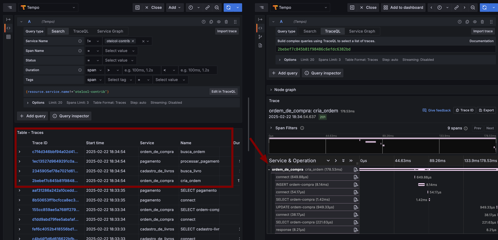
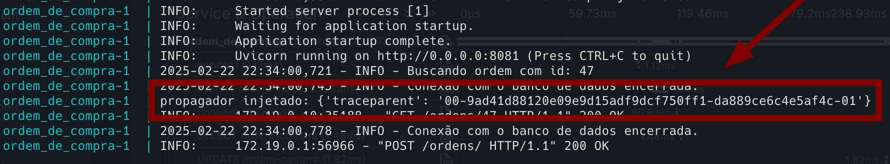

# Propagação de Contexto

Com a propagação de contexto, os sinais podem ser correlacionados entre si, independentemente de onde são gerados. Para compreender a propagação de contexto, precisamos entender dois conceitos distintos: contexto e propagação.

## Contexto
O contexto é um objeto que contém as informações necessárias para correlacionar os serviços emissor e receptor. Por exemplo, quando o serviço Ordem de Compra chamar o serviço Cadastro de Livros para validar se o livro existe, um span do serviço Ordem de Compra, cujo ID está no contexto, será usado como o Traceparent para o próximo trecho criado no serviço Cadastro de Livros. O ID do trace que está no contexto também será usado para o próximo trecho criado no serviço Cadastro de Livros, o que significa que o span faz parte do mesmo trace que o span do serviço Ordem de Compra.

## Propagadores 

Propagação é o meio pelo qual o contexto é transmitido de um serviço para outro geralmente por meio de cabeçalhos HTTP. O OpenTelemetry mantém vários propagadores oficiais. O propagador padrão utiliza os cabeçalhos definidos na especificação [W3C TraceContext](https://www.w3.org/TR/trace-context/).

Quando injetamos e extraímos o contexto, o propagador porta os seguintes campos:

- TraceID (16 bytes)
- SpanID (8 bytes)
- TraceFlags (8 byte)
- TraceState (string ou nulo)

Esses dados são codificados no cabeçalho HTTP através do `Traceparent`. 

- Traceparent = 00-4bf92f3577b34da6a3ce929d0e0e4736-00f067aa0ba902b7-01
  - Versão da especificação = 00
  - Trace-id = 4bf92f3577b34da6a3ce929d0e0e4736
  - Parent-id que iniciou o trace = 00f067aa0ba902b7
  - Trace-flags indica se o trace é amostrado = 01

> Para mais informações sobre a especificação, acesse [W3C TraceContext - Traceparent](https://www.w3.org/TR/trace-context/#traceparent-header-field-values).

## Criando Causalidade entre os Spans

Umas das vantagens da instrumentação sem código é que a propagação de contexto é feita automaticamente. Isso significa que, quando um span é criado em um serviço, o contexto é automaticamente propagado para o próximo. Isso cria uma relação de causalidade entre os spans, o que é fundamental para a análise de performance e para a resolução de problemas.

Após instrumentar o sistema Bookstore manualmente, podemos ver que os spans não estão correlacionados. Isso ocorre porque o contexto não está sendo propagado entre os serviços. Para resolver esse problema, precisamos adicionar a propagação de contexto nas rotas que fazem ou recebem as chamadas HTTP.

A imagem a seguir mostra os spans do sistema Bookstore sem correlação.



### Propagando Contexto com o OpenTelemetry

Antes de implementar a propagação de contexto, precisamos entender em que parte do código devemos injetar e extrair o contexto. O diagrama a seguir mostra o fluxo de execução do sistema Bookstore. Tudo inicia com a criação de uma ordem no serviço Ordem de Compra, que valida se o livro existe no serviço Cadastro de Livros. Se o livro existir, a Ordem de Compra chama o serviço Pagamento para processar o pagamento, o serviço Pagamento valida se a ordem existe e processa o pagamento.


1. Vamos implementar a propagação de contexto iniciando pelo serviço Ordem de Compra na rota que cria uma ordem. Primeiro vamos importar o `TraceContextTextMapPropagator` que será responsável por injetar e extrair o contexto.

    Importe o `TraceContextTextMapPropagator` no arquivo `main.py`.

    ```python
    from opentelemetry.trace.propagation.tracecontext import TraceContextTextMapPropagator
    ```

1. Em seguida, vamos criar a transportadora (`carrier`) que um objeto que contém o TraceID, SpanID, TraceFlags.

    Cria a transportadora e injeta o contexto no serviço Ordem de Compra.

    ```python
    # Propaga o contexto do trace para outros serviços
    carrier = {}
    TraceContextTextMapPropagator().inject(carrier)
    ```

1. Agora, vamos adicionar o `carrier` no hearder da requisição que faz a chamada para o serviço de Cadastro de Livros.

    Adicione o `carrier` no header da requisição.

    ```python
    # Valida disponibilidade do livro no serviço de cadastro de livros
    livro_response = requests.get(f"{BOOK_URL}/livros/{ordem.id_livro}", headers=carrier)
    ```

    Por motivos de curiosidade, podemos imprimir o `carrier` para ver o que está sendo injetado.

    ```python
    print(f"propagador injetado: {carrier}")
    ```

    O código deve ficar assim:

    ```python
    # Define a rota para criar uma ordem
    @app.post("/ordens/", response_model=models.Ordem)
    def cria_ordem(request: Request, ordem: models.OrdemCreate, db: Session = Depends(get_db)):
        """
        Rota para criar uma ordem de compra de um livro
        """
        # Propaga o contexto do trace para outros serviços
        carrier = {}
        TraceContextTextMapPropagator().inject(carrier)

        # Imprime o propagador injetado
        print(f"propagador injetado: {carrier}")

        with tracer.start_as_current_span("cria_ordem") as span:
            try:
                # Valida disponibilidade do livro no serviço de cadastro de livros
                livro_response = requests.get(f"{BOOK_URL}/livros/{ordem.id_livro}", headers=carrier)
                
                if livro_response.status_code != 200:
                    raise HTTPException(status_code=404, detail="Livro não encontrado")
                
                # Valida se o livro está disponível em estoque
                livro = livro_response.json()
                if livro["estoque"] <= 0:
                    raise HTTPException(status_code=404, detail="Livro esgotado")
                
                # Cria ordem de compra
                db_ordem = models.cria_ordem(db=db, ordem=ordem)
                
                # Enviar pagamento para o serviço de Pagamento 
                pagamento_response = requests.post(f"{PAYMENT_URL}/pagamentos", json={"id_ordem": db_ordem.id}) 
                if pagamento_response.status_code != 200: 
                    raise HTTPException(status_code=400, detail="Falha no processamento do pagamento")
                pagamento_response = pagamento_response.json()
                
                # Atualiza status da ordem
                if pagamento_response["status"] == "Aprovado":
                    db_ordem.status = "Concluído"
                else:
                    db_ordem.status = "Pagamento Recusado"
            
                db.commit()
                db.refresh(db_ordem)

                # Adiciona atributos semânticos e personalizados ao span
                span.set_attribute(SpanAttributes.HTTP_METHOD, request.method)
                span.set_attribute(SpanAttributes.HTTP_STATUS_CODE, 201)
                span.set_attribute(SpanAttributes.HTTP_URL, str(request.url))
                span.set_attribute(SpanAttributes.CLIENT_ADDRESS, str(request.client.host))
                span.set_attribute(SpanAttributes.CLIENT_PORT, str(request.client.port))

                # Substitui o atributo da ordem por evento
                span.add_event("Ordem criada com sucesso", attributes={"id_ordem": db_ordem.id, "id_livro": db_ordem.id_livro, "status": db_ordem.status})

                # Define o status OK ao span
                span.set_status(Status(StatusCode.OK))
                
                # Cria um novo span para o response
                with tracer.start_as_current_span("response") as span:
                    # Instrumenta o response
                    response = db_ordem
                    span.set_attribute(SpanAttributes.HTTP_RESPONSE_STATUS_CODE, 201)
                    span.set_attribute(SpanAttributes.EVENT_NAME, "response")
                    
                    # Define status para span
                    span.set_status(Status(StatusCode.OK))

                    return response

            except Exception as e:
                logger.error(f"Erro ao criar ordem: {str(e)}")

                # Define o status Error ao span
                span.set_status(Status(StatusCode.ERROR))

                raise HTTPException(status_code=500, detail=f"Erro ao criar ordem {str(e)}")
    ```

    Em seguida, execute o comando `docker compose up --build ordem_de_compra` para construir e iniciar o serviço.

    ```shell
    docker compose up --build ordem_de_compra
    ```

    - Acesse o endpoint [http://localhost:8081/docs](http://localhost:8081/docs) e crie uma ordem de compra.
    - Acesse o Grafana para visualizar a telemetria gerada [http://localhost:3000](http://localhost:3000).

    Note que nos logs do serviço Ordem de Compra, aparecerá uma mensagem com o `carrier`. Ainda não temos a correlação entre os spans, pois o serviço Cadastro de Livros ainda não está extraindo o contexto.

    

1. Agora, vamos implementar a extração do contexto no serviço Cadastro de Livros na rota lista livro por ID. Primeiro, importe o `TraceContextTextMapPropagator` no arquivo `main.py` do serviço Cadastro de Livros.

    
    Importe o `TraceContextTextMapPropagator` no arquivo `main.py`.

    ```python
    from opentelemetry.trace.propagation.tracecontext import TraceContextTextMapPropagator
    ```

    Em seguida, vamos extrair o contexto do header da requisição.

    ```python
    # Extrai o contexto do trace dos headers HTTP
    carrier = dict(request.headers)
    ctx = TraceContextTextMapPropagator().extract(carrier)
    ```

    Agora adicione o contexto ao tracer da rota `GET /livros/{id}`.

    ```python
    with tracer.start_as_current_span("busca_livro", context=ctx) as span:
    ```

    Por motivos de curiosidade, podemos imprimir o `carrier` para ver o que está sendo extraído.

    ```python
    # Imprime o propagador extraído
    print(f"propagador extraído: {carrier}")
    ```

    O código deve ficar assim:

    ```python
    # Define a rota para listar livros por id
    @app.get("/livros/{id}")
    def busca_livro(request: Request, id: int, db: Session = Depends(get_db)):
        """
        Rota para buscar um livro pelo id
        """
        # Extrai o contexto do trace dos headers HTTP
        carrier = dict(request.headers)
        ctx = TraceContextTextMapPropagator().extract(carrier)
        
        # Imprime o propagador extraído
        print(f"propagador extraído: {carrier}")
        
        with tracer.start_as_current_span("busca_livro", context=ctx) as span:
            try:
                # Busca um livro no banco de dados
                logger.info(f"Buscando livro com id: {id}")
                livro = models.busca_livro(db, id)
                
                # Adiciona atributos semânticos e personalizados ao span
                span.set_attribute(SpanAttributes.HTTP_METHOD, request.method)
                span.set_attribute(SpanAttributes.HTTP_STATUS_CODE, 200)
                span.set_attribute(SpanAttributes.HTTP_URL, str(request.url))
                span.set_attribute(SpanAttributes.CLIENT_ADDRESS, str(request.client.host))
                span.set_attribute(SpanAttributes.CLIENT_PORT, str(request.client.port  ))
                
                # Substitui o atributo titulo do livro por evento
                span.add_event("Livro encontrado com sucesso", attributes={"id": livro.id, "titulo": livro.titulo})

                # Define o status OK ao span
                span.set_status(Status(StatusCode.OK))

                if livro is None or livro == []:
                    logger.warning(f"Livro com id {id} não encontrado")
                    raise HTTPException(status_code=404, detail="Livro não encontrado")
                logger.info(f"Livro com ID: {id} encontrado com sucesso")
                
                # Cria um novo span para o response
                with tracer.start_as_current_span("response") as span:

                    # Instrumenta o response
                    span.set_attribute(SpanAttributes.HTTP_RESPONSE_STATUS_CODE, 200)
                    span.set_attribute(SpanAttributes.EVENT_NAME, "response")
                    response = livro

                    # Define status para span
                    span.set_status(Status(StatusCode.OK))

                    return response
            
            except Exception as e:
                logger.error(f"Erro ao buscar livro: {e}")

                # Define o status Error ao span
                span.set_status(Status(StatusCode.ERROR))

                raise HTTPException(status_code=500, detail="Erro ao buscar livro")
    ```

    Em seguida, execute o comando `docker compose up --build cadastro_de_livros` para construir e iniciar o serviço.

    ```shell
    docker compose up --build cadastro_de_livros
    ```

    - Acesse o endpoint [http://localhost:8081/docs](http://localhost:8081/docs) e crie uma ordem de compra.
    - Acesse o Grafana para visualizar a telemetria gerada [http://localhost:3000](http://localhost:3000).

    Note que temos uma correlação entre os spans do serviço Ordem de Compra e Cadastro de Livros.

    

    Veja os logs do serviço Cadastro de Livros e Ordem de Compra perceba as linhas com `propagador extraído` e `propagador injetado`.

    

1. Agora, vamos implementar a extração do contexto no serviço Pagamento na rota processa pagamento. Primeiro, importe o `TraceContextTextMapPropagator` no arquivo `main.py` do serviço Pagamento.

    Importe o `TraceContextTextMapPropagator` no arquivo `main.py`.

    ```python
    from opentelemetry.trace.propagation.tracecontext import TraceContextTextMapPropagator
    ```

    Em seguida, vamos extrair o contexto do header da requisição.

    ```python
    # Extrai o contexto do trace dos headers HTTP
    carrier = dict(request.headers)
    ctx = TraceContextTextMapPropagator().extract(carrier)
    ```

    Agora adicione o contexto ao tracer da rota `POST /pagamentos`.

    ```python
    with tracer.start_as_current_span("processar_pagamento", context=ctx) as span:
    ```

    Por motivos de curiosidade, podemos imprimir o `carrier` para ver o que está sendo extraído.

    ```python
    # Imprime o propagador extraído
    print(f"propagador extraído: {carrier}")
    ```

    O código deve ficar assim:

    ```python
    # Define a rota para processar pagamento
    @app.post("/pagamentos", response_model=models.Pagamento)
    def processar_pagamento(request: Request, pagamento: models.PagamentoCreate, db: Session = Depends(get_db)):
        """
        Processa um pagamento para a ordem especificada
        """
        # Extrai o contexto do trace dos headers HTTP
        carrier = dict(request.headers)
        ctx = TraceContextTextMapPropagator().extract(carrier)

        # Imprime o propagador extraído
        print(f"propagador extraído: {carrier}")

        with tracer.start_as_current_span("processar_pagamento", context=ctx) as span:
            try:
                # Valida se a ordem de compra existe
                ordem_response = requests.get(f"{ORDER_URL}/ordens/{pagamento.id_ordem}")
                if ordem_response.status_code != 200:

                    # Adiciona atributos semânticos e personalizados ao span
                    span.set_attribute(SpanAttributes.HTTP_METHOD, request.method)
                    span.set_attribute(SpanAttributes.HTTP_STATUS_CODE, 404)
                    span.set_attribute(SpanAttributes.HTTP_URL, str(request.url))
                    span.set_attribute(SpanAttributes.CLIENT_ADDRESS, str(request.client.host))
                    span.set_attribute(SpanAttributes.CLIENT_PORT, str(request.client.port))
                    
                    # Substitui o atributo sobre a ordem de compra por evento
                    span.add_event("Ordem de compra não encontrada", attributes={"ordem.id": pagamento.id_ordem})
                    
                    # Define o status de Erro ao span
                    span.set_status(Status(StatusCode.ERROR))
                    raise HTTPException(status_code=404, detail="Ordem de compra não encontrada")
                
                # Processa pagamento
                status = random.choice(["Aprovado", "Recusado"])

                # Adiciona atributos semânticos e personalizados ao span
                span.set_attribute(SpanAttributes.HTTP_METHOD, request.method)
                span.set_attribute(SpanAttributes.HTTP_STATUS_CODE, 201)
                span.set_attribute(SpanAttributes.HTTP_URL, str(request.url))
                span.set_attribute(SpanAttributes.CLIENT_ADDRESS, str(request.client.host))
                span.set_attribute(SpanAttributes.CLIENT_PORT, str(request.client.port))

                # Substitui o atributo sobre o pagamento por evento
                span.add_event("Pagamento processado com sucesso", attributes={"pagamento.status": status})
                
                # Cria o pagamento no banco
                db_pagamento = models.processar_pagamento(db=db, pagamento=pagamento, status=status)
                
                # Definição o status OK ao span
                span.set_status(Status(StatusCode.OK))

                with tracer.start_as_current_span("response") as span:
                    # Instrumenta o response
                    response = db_pagamento
                    span.set_attribute(SpanAttributes.HTTP_RESPONSE_STATUS_CODE, 201)
                    span.set_attribute(SpanAttributes.EVENT_NAME, "response")
                    
                    # Define status para span
                    span.set_status(Status(StatusCode.OK))

                    return response
            except Exception as e:
                logger.error(f"Erro ao processar pagamento: {str(e)}")

                # Define o status de Erro ao span
                span.set_status(Status(StatusCode.ERROR))

                raise HTTPException(status_code=500, detail=f"Erro ao processar pagamento: {str(e)}")
    ```

    Ultimo passo, precisamos adicionar o `carrier` no header da requisição que envia a ordem de compra para o serviço de Pagamento.

    Adicione o `carrier` no header da requisição no `main.py`do serviço Ordem de Compra.

    ```python
    # Enviar pagamento para o serviço de Pagamento 
    pagamento_response = requests.post(f"{PAYMENT_URL}/pagamentos", json={"id_ordem": db_ordem.id}, headers=carrier) 
    ```

    Em seguida, execute o comando `docker compose up --build pagamento ordem_de_compra` para construir e iniciar os serviços.

    ```shell
    docker compose up --build pagamento ordem_de_compra
    ```

    - Acesse o endpoint [http://localhost:8081/docs](http://localhost:8081/docs) e crie uma ordem de compra.
    - Acesse o Grafana para visualizar a telemetria gerada [http://localhost:3000](http://localhost:3000).

    Note que temos uma correlação entre os spans do serviço Ordem de Compra, Cadastro de Livros e Pagamento.

    

    Veja os logs do serviço Ordem de Compra, Cadastro de Livros e Pagamento perceba as linhas com `propagador extraído` e `propagador injetado`.

    

1. O ultimo passo será propagar o contexto no momento em que o serviço Pagamento valida se a ordem existe. Para isso, vamos adicionar o `carrier` no header da requisição do serviço Pagamento.

    Adicione o `carrier` no header da requisição no `main.py`do serviço Pagamento.

    ```python
    # Valida se a ordem de compra existe
    ordem_response = requests.get(f"{ORDER_URL}/ordens/{pagamento.id_ordem}" , headers=carrier)
    ```

    Em seguida, execute o comando `docker compose up --build pagamento` para construir e iniciar o serviço.

    ```shell
    docker compose up --build pagamento
    ```

    - Acesse o endpoint [http://localhost:8081/docs](http://localhost:8081/docs) e crie uma ordem de compra.
    - Acesse o Grafana para visualizar a telemetria gerada [http://localhost:3000](http://localhost:3000).

    Note que temos uma correlação entre os spans do serviço Ordem de Compra, Cadastro de Livros e Pagamento.

    

## Conclusão

Neste guia, aprendemos sobre a propagação de contexto e como correlacionar os spans entre os serviços. Apenas em cenários muitos específicos precisamos injetar e extrair o contexto manualmente na grande maioria das vezes o OpenTelemetry faz isso automaticamente para nós. A propagação de contexto é fundamental para criar uma relação de causalidade entre os spans, o que é essencial para a análise de performance e para a resolução de problemas.
