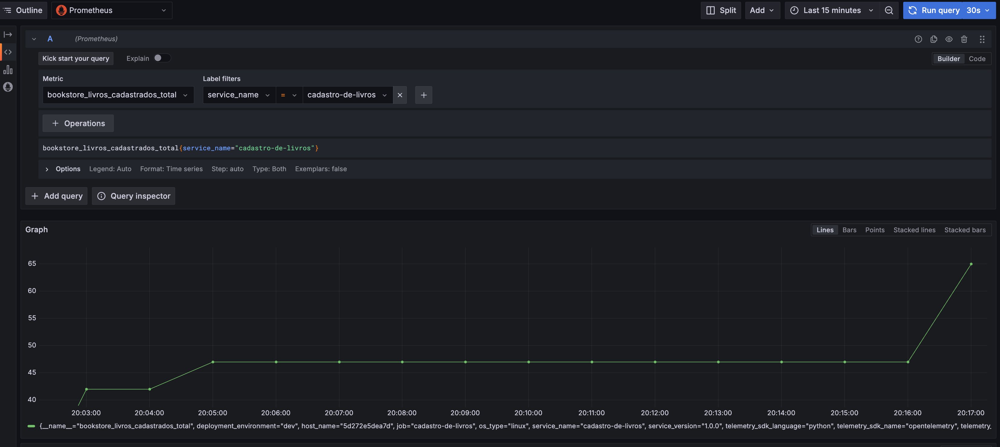
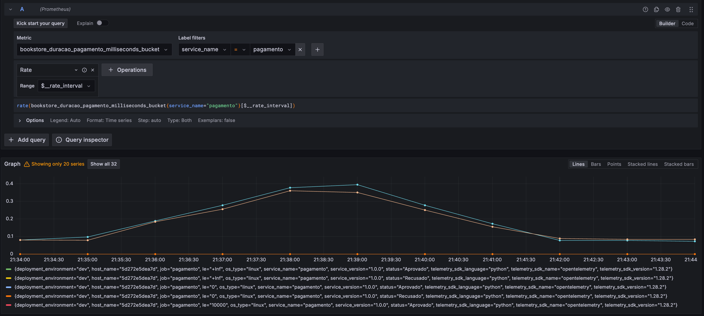
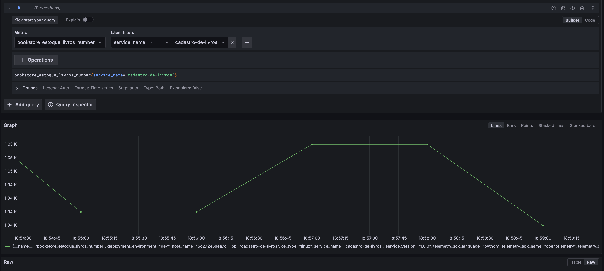

## Criando Métricas

Antes de começar a criar métricas do sistema Bookstore, precisamos relembrar quais os principais tipos de métricas do OpenTelemetry.

- **Counter**: Um valor que acumula com o tempo, esse valor só cresce. São muito utilizadas para contagem de eventos: número de requisições HTTP, número de erros, quantidade de acessos. 

- **Gauge**: Um valor que pode aumentar ou diminuir ao longo do tempo. São muito utilizadas para representar valores instantâneos: uso de CPU, memória, etc.

- **Histogram**: Um contador que fornece a distribuição de valores em um intervalo. São muito utilizadas para medir a distribuição de valores: tempo de resposta de uma requisição entre 0-100ms, 100-200ms, tamanho de arquivos.

### Cardinalidade

Cardinalidade se refere ao número de valores possíveis que uma métrica pode assumir. Métricas com alta cardinalidade podem ser mais difíceis de armazenar e processar.

#### Exemplos

- **Alta Cardinalidade**: Monitorar os números de placa de cada carro no estacionamento. (Muitos valores únicos, um para cada carro).

- **Baixa Cardinalidade**: Contar quantos carros são de cada cor no estacionamento. (Poucos valores únicos, como vermelho, azul, preto).

### Criando Métrica Counter

1. Adicione os seguintes pacotes ao arquivo [`requirements.txt`](../../book_store/cadastro_de_livros/requirements.txt) do serviço Cadastro de Livros:

    ```txt
    opentelemetry-api==1.28.2
    opentelemetry-sdk==1.28.2
    opentelemetry-exporter-otlp==1.28.2
    ```

    - `opentelemetry-api`: contém a interface para instrumentar o código.
    - `opentelemetry-sdk`: é a implementação da API do OpenTelemetry.
    - `opentelemetry-exporter-otlp`: é responsável por enviar as métricas para o OpenTelemetry Collector.

1. Para criar métricas no OpenTelemetry, é necessário configurar o `MeterProvider` que é responsável por criar e gerenciar as métricas. O `MetricReader` é responsável por exportar as métricas para o OpenTelemetry Collector e o `Resource` contém os atributos do serviço. Vamos iniciar a criação das métricas no serviço de Cadastro de Livros. Para deixar a estrutura do projeto mais organizado, crie um arquivo chamado `metrics.py` no diretório apps do serviço [Cadastro de Livros](../../book_store/cadastro_de_livros/app/).
    
    Crie um arquivo chamado `metrics.py` no diretório `app` do serviço Cadastro de Livros.

    ```python
    # metrics.py
    """
    Módulo para configurar o MeterProvider do OpenTelemetry
    """
    from opentelemetry import metrics
    from opentelemetry.sdk.resources import Resource
    from opentelemetry.sdk.metrics import MeterProvider
    from opentelemetry.sdk.metrics.export import PeriodicExportingMetricReader
    from opentelemetry.exporter.otlp.proto.http.metric_exporter import OTLPMetricExporter

    def configure_meter():
        """
        Configura medidor com OpenTelemetry.
        """
        # Configura o exportador de métricas
        exporter = OTLPMetricExporter(
            endpoint="http://otelcollector:4318/v1/metrics",               
        )

        # Cria o leitor para exportação periódica (ex: a cada 60s)
        reader = PeriodicExportingMetricReader(exporter, export_interval_millis=60000)

        # Define os atributos do recurso
        resource = Resource.create({
            "service.name": "cadastro-de-livros",
            "service.version": "0.1.0",
            "deployment.environment": "dev",
        })

        # Cria o provedor de métricas com o leitor
        provider = MeterProvider(
            resource=resource,       # Define os atributos do recurso
            metric_readers=[reader]  # Adiciona o leitor ao provider
        )

        # Define o provedor de métricas
        metrics.set_meter_provider(provider) 

        # Retorna o medidor para criar métricas
        return metrics.get_meter(__name__)
    ```

1. A primeira métrica que vamos criar é um `counter` para contar a quantidade de livros cadastrados. Essa métrica é importante para monitorar o crescimento do catálogo de livros. Antes de implementar a métrica, é necessário definir o tipo, descrição e unidade de medida da métrica. 

    No arquivo [metrics.py](../../book_store/cadastro_de_livros/app/metrics.py) crie a definição da métrica `total_livros`.

    ```python
    """
    Definição das métricas do serviço
    """
    livros_cadastrados = configure_meter().create_counter(
        name="bookstore.livros.cadastrados",
        description="Total de livros cadastrados",
        unit="number",
    )
    ```

    - bookstore.livros.cadastrados: é o nome da métrica, é uma boa prática usar um `namespace` para as métricas. Neste caso, `bookstore` é o namespace, `livros.cadastrados` é o nome da métrica.
    - create_counter: cria um contador.
    - description: é a descrição da métrica.
    - unit: é a unidade de medida da métrica, neste caso, número.

1. Agora, vamos incrementar o contador para métrica `bookstore.livros.cadastrados` toda vez que um livro for cadastrado. No arquivo [`models.py`](../../book_store/cadastro_de_livros/app/models.py) do serviço Cadastro de Livros, adicione o código abaixo:

    Importa a métrica `livros_cadastrados` do arquivo `metrics.py`.

    ```python
    # models.py
    from .metrics import livros_cadastrados
    ```

    Incrementa o contador `livros_cadastrados` toda vez que um livro for cadastrado.

    ```python
    # models.py
    # Função que cria um livro no banco de dados
    def cria_livro(db: Session, livro: LivroBase):
        """
        Função que cria um livro no banco de dados
        """
        try:
            db_livro = Livros(titulo=livro.titulo, estoque=livro.estoque)
            db.add(db_livro)
            db.commit()
            db.refresh(db_livro)
            
            # Incrementa a métrica total_livros_cadastrados
            livros_cadastrados.add(1)
            
            return db_livro
        except Exception as e:
            logger.error(f"Erro ao criar livro no banco de dados: {e}")
            raise
    ```

    O método `add` incrementa o contador em 1 toda vez que um livro for cadastrado.

    Em seguida, execute o comando `docker compose up --build cadastro_de_livros` para construir e iniciar o serviço `cadastro_de_livros`.

    ```shell
    docker compose up --build cadastro_de_livros
    ```

    - Acesse o endpoint [http://localhost:8080/docs](http://localhost:8080/docs) cadastre alguns livros.
    - Acesse o Grafana para visualizar a telemetria gerada [http://localhost:3000](http://localhost:3000).

    Note que a métrica `bookstore_livros_cadastrados_total` contém o valor da quantidade de livros cadastrados. 
    
    > O exporter do OpenTelemetry Collector altera o nome da métrica substituindo os pontos por `_` e adicionando o sufixo `_total` para seguir a convenção do Prometheus.

    

### Criando Métrica Histogram

1. Adicione os seguintes pacotes ao arquivo [`requirements.txt`](../../book_store/pagamento/requirements.txt) do serviço Pagamento:

    ```txt
    opentelemetry-api==1.28.2
    opentelemetry-sdk==1.28.2
    opentelemetry-exporter-otlp==1.28.2
    ```

1. Agora, vamos criar uma métrica do tipo `histogram` para medir a duração que um pagamento é processado. No diretório `app` do serviço [pagamento](../../book_store/pagamento/app/) crie um arquivo chamado `metrics.py`.

    Crie um arquivo chamado `metrics.py` no diretório `app` da aplicação Pagamento.

    ```python
    # metrics.py
    """
    Módulo para configurar o MeterProvider do OpenTelemetry
    """
    from opentelemetry import metrics
    from opentelemetry.sdk.resources import Resource
    from opentelemetry.sdk.metrics import MeterProvider
    from opentelemetry.sdk.metrics.export import PeriodicExportingMetricReader
    from opentelemetry.exporter.otlp.proto.http.metric_exporter import OTLPMetricExporter

    def configure_meter():
        """
        Configura medidor com OpenTelemetry.
        """
        # Configura o exportador de métricas
        exporter = OTLPMetricExporter(
            endpoint="http://otelcollector:4318/v1/metrics",               
        )

        # Cria o leitor para exportação periódica (ex: a cada 60s)
        reader = PeriodicExportingMetricReader(exporter, export_interval_millis=60000)

        # Define os atributos do recurso
        resource = Resource.create({
            "service.name": "cadastro-de-livros",
            "service.version": "0.1.0",
            "deployment.environment": "dev",
        })

        # Cria o provedor de métricas com o leitor
        provider = MeterProvider(
            resource=resource,       # Define os atributos do recurso
            metric_readers=[reader]  # Adiciona o leitor ao provider
        )

        # Define o provedor de métricas
        metrics.set_meter_provider(provider) 

        # Retorna o medidor para criar métricas
        return metrics.get_meter(__name__)
    ```

1. No arquivo [metrics.py](../../book_store/pagamento/app/metrics.py) do serviço Pagamento, crie a definição da métrica `duracao_pagamento`. Essa métrica é importante para monitorar o tempo que um pagamento é processado.

    No arquivo [metrics.py](../../book_store/pagamento/app/metrics.py) crie a definição da métrica `duracao_pagamento`.

    ```python
    """
    Definição das métricas do serviço
    """
    duracao_pagamento = configure_meter().create_histogram(
        name="bookstore.duracao.pagamento",
        description="Duração do pagamento",
        unit="ms",
    )
    ```

    - bookstore.duracao.pagamento: é o namespace e o nome da métrica.
    - create_histogram: cria um histograma.
    - description: é a descrição da métrica.
    - unit: é a unidade de medida da métrica, neste caso, milissegundos.

1. Agora, vamos medir a duração do pagamento no serviço de Pagamento. Na rota de pagamento do arquivo [`main.py`](../../book_store/pagamento/app/main.py), adicione o código abaixo:

    Importa a métrica `duracao_pagamento` e o pacote `time`.

    ```python
    # main.py
    from .metrics import duracao_pagamento
    import time
    ```

    Registra a duração do pagamento no histograma `duracao_pagamento`.

    ```python
    # main.py
    # Define a rota para processar pagamento
    @app.post("/pagamentos", response_model=models.Pagamento)
    def processar_pagamento(pagamento: models.PagamentoCreate, db: Session = Depends(get_db)):
        """
        Processa um pagamento para a ordem especificada
        """
        try:
            # Inicia o contador de tempo
            start_time = time.time()

            # Valida se a ordem de compra existe
            ordem_response = requests.get(f"{ORDER_URL}/ordens/{pagamento.id_ordem}")
            if ordem_response.status_code != 200:
                raise HTTPException(status_code=404, detail="Ordem de compra não encontrada")
            
            # Processa pagamento
            status = random.choice(["Aprovado", "Recusado"])
            
            # Cria o pagamento no banco
            db_pagamento = models.processar_pagamento(db=db, pagamento=pagamento, status=status)
            
            # Calcula a duração do pagamento
            duracao = time.time() - start_time
            # Registra a duração do pagamento
            duracao_pagamento.record(duracao, {"status": status})
            
            return db_pagamento
        except Exception as e:
            logger.error(f"Erro ao processar pagamento: {str(e)}")
            raise HTTPException(status_code=500, detail=f"Erro ao processar pagamento: {str(e)}")
    ```

    Estamos utilizando o `time` para medir a duração do pagamento, estamos registrando o tempo inicial em segundos `start_time` e calculando a duração do pagamento em segundos `duracao`. Em seguida, registramos a duração do pagamento no histograma `duracao_pagamento` adicionando também o status do pagamento como atributo da métrica.
    
    Em seguida, execute o comando `docker compose up --build pagamento` para construir e iniciar o serviço `pagamento`.

    ```shell
    docker compose up --build pagamento
    ```

    - Acesse o endpoint [http://localhost:8081/docs](http://localhost:8081/docs) processe algumas ordens de pagamento.
    - Acesse o Grafana para visualizar a telemetria gerada [http://localhost:3000](http://localhost:3000).

    Note que no Grafana aparece três métricas:
    - A métrica `bookstore_duracao_pagamento_count` contém a quantidade de valores no histograma.
    - A métrica `bookstore_duracao_pagamento_sum` contém a soma dos valores no histograma.
    - A métrica `bookstore_duracao_pagamento_milliseconds_bucket` contém o valor em milissegundos da duração do pagamento.

    

### Criando Métrica Gauge

1. Vamos criar uma métrica do tipo `gauge` para medir a quantidade de livros em estoque. Essa métrica é importante para monitorar a quantidade de livros disponíveis para venda. Primeiro, crie a definição da métrica `estoque_livros` no arquivo [metrics.py](../../book_store/cadastro_de_livros/app/metrics.py) do serviço Cadastro de Livros.

    No arquivo [metrics.py](../../book_store/cadastro_de_livros/app/metrics.py) crie a definição da métrica `estoque_livros`.

    ```python
    estoque_livros = configure_meter().create_gauge(
        name="bookstore.estoque.livros",
        description="Quantidade de livros em estoque",
        unit="number",
    )
    ```

    - bookstore.estoque.livros: é o namespace e o nome da métrica.
    - create_gauge: cria um medidor.
    - description: é a descrição da métrica.
    - unit: é a unidade de medida da métrica, neste caso, número.

1. Próximo passo é atualizar a métrica `estoque_livros` toda vez que um livro for cadastrado ou removido do serviço Cadastro de Livros. No arquivo [`models.py`](../../book_store/cadastro_de_livros/app/models.py) do serviço Cadastro de Livros, adicione o código abaixo:

    Importa a métrica `estoque_livros` do arquivo `metrics.py`.

    ```python
    # models.py
    from .metrics import estoque_livros
    ```

    Atualiza a métrica `estoque_livros` toda vez que um livro for cadastrado ou removido.

    ```python
    # models.py
    # Função que cria um livro no banco de dados
    def cria_livro(db: Session, livro: LivroBase):
        """
        Função que cria um livro no banco de dados
        """
        try:
            db_livro = Livros(titulo=livro.titulo, estoque=livro.estoque)
            db.add(db_livro)
            db.commit()
            db.refresh(db_livro)
            
            # Atualiza a métrica estoque_livros
            estoque_livros.set(db.query(Livros).count())
            
            return db_livro
        except Exception as e:
            logger.error(f"Erro ao criar livro no banco de dados: {e}")
            raise

    # Função que remove um livro do banco de dados
    def remove_livro(db: Session, livro_id: int):
        """
        Função que remove um livro do banco de dados
        """
        try:
            db_livro = db.query(Livros).filter(Livros.id == livro_id).first()
            if db_livro:
                db.delete(db_livro)
                db.commit()
                
                # Atualiza a métrica estoque_livros
                estoque_livros.set(db.query(Livros).count())
                
                return db_livro
            else:
                raise HTTPException(status_code=404, detail="
                Livro não encontrado")
        except Exception as e:
            logger.error(f"Erro ao remover livro do banco de dados: {e}")
            raise
    ```

    Estamos utilizando uma `query` para contar a quantidade de livros em estoque e atualizar a métrica `estoque_livros` toda vez que um livro for cadastrado ou removido.

    Em seguida, execute o comando `docker compose up --build cadastro_de_livros` para construir e iniciar o serviço `cadastro_de_livros`.

    ```shell
    docker compose up --build cadastro_de_livros
    ```

    - Acesse o endpoint [http://localhost:8080/docs](http://localhost:8080/docs) cadastre alguns livros e remova alguns livros.
    - Acesse o Grafana para visualizar a telemetria gerada [http://localhost:3000](http://localhost:3000).

    Note que a métrica `bookstore_estoque_livros` contém o valor da quantidade de livros em estoque.

    

## Exercício

1. Crie uma métrica do tipo `counter` com agregação por `status` para medir a quantidade de ordens de compra processadas no serviço de Ordem de Compra.
  - Lembre de importar os pacotes necessários no arquivo `requirements.txt`.
  - Lembre de criar o `MeterProvider` e o `MetricReader` no arquivo `metrics.py`.
2. Crie uma métrica do tipo `histogram` com agregação por `status` para medir a duração que uma ordem de compra é processada no serviço de Ordem de Compra.
  - Lembre de importar o modulo `time` para medir a duração da ordem de compra.

### Conclusão

Neste módulo, aprendemos a criar métricas no sistema Bookstore utilizando o OpenTelemetry.
