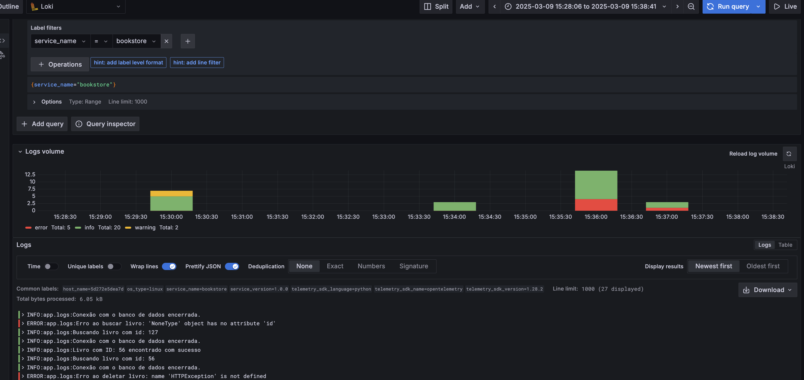
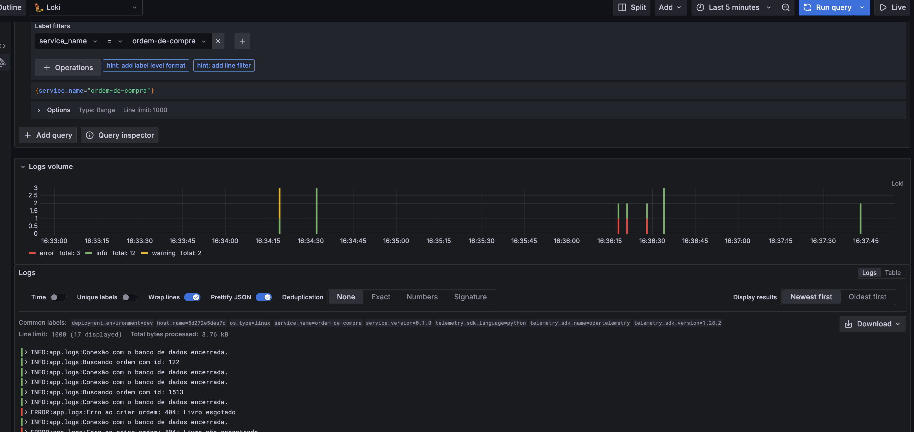

# Instrumentando Logs

Embora o suporte para logs esteja em [desenvolvimento](https://opentelemetry.io/docs/languages/python/), é possível instrumentar logs Python com OpenTelemetry. O OpenTelemetry fornece um [`Bridge`](https://opentelemetry.io/docs/specs/otel/logs/api/) para logs, que permite a integração com bibliotecas de logs existentes, como `logging`.

Para este módulo, utilize o Book_Store instrumentado com `traces` e `metrics` dos módulos anteriores. 

## Configurando Logs OpenTelemetry no Cadastro de Livros

1. Seguindo a estrutura do projeto, crie um arquivo `logs.py` no diretório [`app/`](../../book_store/cadastro_de_livros/app/) do serviço Cadastro de Livros.

    Adicione o seguinte conteúdo ao arquivo `logs.py`:

    ```python
    """
    Módulo para configurar o LoggerProvider do OpenTelemetry
    """
    import logging
    from opentelemetry._logs import set_logger_provider
    from opentelemetry.exporter.otlp.proto.http._log_exporter import OTLPLogExporter
    from opentelemetry.sdk._logs import LoggerProvider, LoggingHandler
    from opentelemetry.sdk._logs.export import BatchLogRecordProcessor
    from opentelemetry.sdk.resources import Resource

    # Configura o exportador de logs (mesmo endpoint do coletor)
    exporter = OTLPLogExporter(
        endpoint="http://otelcollector:4318/v1/logs"
    )

    # Configura recursos (mesmo usado nas métricas/traces)
    resource = Resource.create({
        "service.name": "cadastro-de-livros",
        "service.version": "0.1.0",
        "deployment.environment": "dev",
    })

    # Configura o LoggerProvider
    provider = LoggerProvider(resource=resource)
    provider.add_log_record_processor(BatchLogRecordProcessor(exporter))
    set_logger_provider(provider)

    # Configura o handler OpenTelemetry para logging padrão
    handler = LoggingHandler(logger_provider=provider)
    logging.basicConfig(handlers=[handler], level=logging.INFO, force=True)

    # Cria o logger global
    logger = logging.getLogger(__name__)
    ```

    O `LoggerProvider` é configurado com um `BatchLogRecordProcessor` que envia logs para o exportador `OTLPLogExporter`. O `Resource` é configurado com as mesmas informações de serviço e ambiente usadas para métricas e traces.

    Por fim, configuramos o `LoggingHandler` para ser o handler padrão do `logging` e criamos um logger global.

1. Próximo passo será importar o módulo `logs` no arquivo `main.py` do serviço Cadastro de Livros.

    Substitua a linha `from . import logger` por `from .logs import logger`.

    ```python
    # main.py
    from .logs import logger
    ```

    Faça o mesmo para outros arquivos [`models.py`](../../book_store/cadastro_de_livros/app/models.py) e [`database.py`](../../book_store/cadastro_de_livros/app/databases.py) do serviço Cadastro de Livros.

1. Agora, remova o conteúdo do arquivo `__init__.py` do diretório [`app/`](../../book_store/cadastro_de_livros/app/) do serviço Cadastro de Livros.

    ```python
    # __init__.py
    """
    Indica que o diretório é um pacote Python
    """
    ```

    Não é mais necessário utilizar a configuração de logger do arquivo `__init__.py`, pois agora estamos utilizando o `LoggerProvider` do OpenTelemetry.

    Em seguida, execute o comando `docker compose up --build cadastro-de-livros` para construir e iniciar o serviço `Cadastro de Livros`.

    ```shell
    docker compose up --build cadastro-de-livros
    ```

    - Acesso o endpoint [http://localhost:8080/docs](http://localhost:8080/docs) execute algumas operações para gerar logs.
    - Acesse o Grafana para visualizar a telemetria gerada [http://localhost:3000](http://localhost:3000).

    Note que os logs gerados pelo serviço Cadastro de Livros estão sendo exportados para Grafana Loki no formato OTLP. O log contém os mesmos atributos de contexto que as métricas e traces. Além disso, o log é associado ao trace ID e span ID correspondentes.

    

## Configurando Logs OpenTelemetry no Ordem de Compra

1. Repita os passos anteriores para configurar os logs OpenTelemetry no serviço Ordem de Compra.

    Crie um arquivo `logs.py` no diretório [`app`](../../book_store/ordem_de_compra/app/) do serviço Ordem de Compra.

    ```python
    """
    Módulo para configurar o LoggerProvider do OpenTelemetry
    """
    import logging
    from opentelemetry._logs import set_logger_provider
    from opentelemetry.exporter.otlp.proto.http._log_exporter import OTLPLogExporter
    from opentelemetry.sdk._logs import LoggerProvider, LoggingHandler
    from opentelemetry.sdk._logs.export import BatchLogRecordProcessor
    from opentelemetry.sdk.resources import Resource

    # Configura o exportador de logs (mesmo endpoint do coletor)
    exporter = OTLPLogExporter(
        endpoint="http://otelcollector:4318/v1/logs"
    )

    # Configura recursos (mesmo usado nas métricas/traces)
    resource = Resource.create({
        "service.name": "ordem-de-compra",
        "service.version": "0.1.0",
        "deployment.environment": "dev",
    })

    # Configura o LoggerProvider
    provider = LoggerProvider(resource=resource)
    provider.add_log_record_processor(BatchLogRecordProcessor(exporter))
    set_logger_provider(provider)

    # Configura o handler OpenTelemetry para logging padrão
    handler = LoggingHandler(logger_provider=provider)
    logging.basicConfig(handlers=[handler], level=logging.INFO, force=True)

    # Cria o logger global
    logger = logging.getLogger(__name__)
    ```

1. Importe o módulo `logs` no arquivo `main.py` do serviço Ordem de Compra.

    Substitua a linha `from . import logger` por `from .logs import logger`.

    ```python
    # main.py
    from .logs import logger
    ```

    Faça o mesmo para outros arquivos [`models.py`](../../book_store/ordem_de_compra/app/models.py) e [`database.py`](../../book_store/ordem_de_compra/app/databases.py) do serviço Ordem de Compra.

1. Remova o conteúdo do arquivo `__init__.py` do diretório [`app/`](../../book_store/ordem_de_compra/app/) do serviço Ordem de Compra.

    ```python
    # __init__.py
    """
    Indica que o diretório é um pacote Python
    """
    ```

    Execute o comando `docker compose up --build ordem-de-compra` para construir e iniciar o serviço `Ordem de Compra`.

    ```shell
    docker compose up --build ordem-de-compra
    ```

    - Acesso o endpoint [http://localhost:8081/docs](http://localhost:8081/docs) execute algumas operações para gerar logs.
    - Acesse o Grafana para visualizar a telemetria gerada [http://localhost:3000](http://localhost:3000).

    Note que os logs gerados pelo serviço Ordem de Compra estão sendo exportados para Grafana Loki no formato OTLP. O log contém os mesmos atributos de contexto que as métricas e traces. Além dis
    so, o log é associado ao trace ID e span ID correspondentes.

    


## Exercício

1. Adicione logs no formato OpenTelemetry no serviço Pagamento.
  - Crie um arquivo `logs.py`.
  - Importe o módulo `logs` nos arquivos `main.py`, `models.py` e `database.py`.
  - Remova o conteúdo do arquivo `__init__.py`.

## Conclusão

Neste módulo, aprendemos a instrumentar logs Python com OpenTelemetry.
