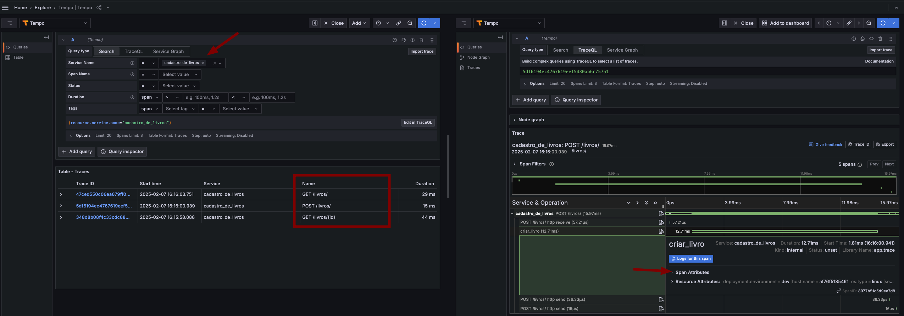
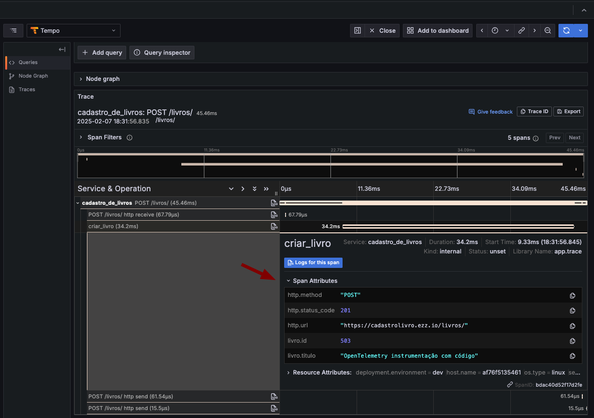

## Instrumentação Manual

A instrumentação manual é o processo de adicionar código no código da aplicações para gerar dados de telemetria. A instrumentação manual é feita utilizando APIs e SDKs do OpenTelemetry.

> A instrumentação manual é recomendada para cenários em que a instrumentação sem código não é suficiente ou você deseja ter mais controle sobre o processo de instrumentação.

## Pré-requisitos

Antes de começar remova a instrumentação sem código do projeto, remova as bibliotecas OpenTelemetry do arquivo `requirements.txt` e remova as linhas `RUN opentelemetry-bootstrap -a install` e `opentelemetry-instrument` do arquivo `Dockerfile` dos microserviços.

Ou, crie uma nova branch a partir da branch `main` para adicionar a instrumentação com código.

```shell
git checkout main
git ceckout -b feat/instrumentacao-manual
```

### Crianção de Trace

1. Adicione a instrumentação manual nas aplicações de exemplo. Vamos inciar pela aplicação [Cadastro de Livro](../book_store/cadastro_de_livros/) por ser uma aplicação simples. Para adicionar instrumentação manual, é necessário instalar os pacotes do OpenTelemetry.

Adicione os seguintes pacotes ao arquivo [requirements.txt](../book_store/cadastro_de_livros/requirements.txt):

   ```txt
   opentelemetry-api==1.28.2
   opentelemetry-sdk==1.28.2
   opentelemetry-exporter-otlp==1.28.2
   opentelemetry-instrumentation-fastapi==0.49b2
   opentelemetry-instrumentation-sqlalchemy==0.49b2
   ```

   Os pacotes listados acima são necessários para configurar a instrumentação manual. O pacote `opentelemetry-api` contém a API do OpenTelemetry, que é uma interface para a instrumentação. O pacote `opentelemetry-sdk` contém a implementação da API para iniciar a instrumentação. O pacote `opentelemetry-exporter-otlp` contém o exportador OTLP, que é responsável por enviar os dados de telemetria para o OpenTelemetry Collector. O pacote `opentelemetry-instrumentation-fastapi` contém a instrumentação para o FastAPI. O pacote `opentelemetry-instrumentation-sqlalchemy` contém a instrumentação para o SQLAlchemy.

   > Para saber mais sobre API e SDK do OpenTelemetry, consulte a [Espeficação](https://github.com/open-telemetry/opentelemetry-specification/tree/main/specification).

1. Para iniciar a instrumentação, é necessário instanciar o `TracerProvider`, ele será nossa produtor de `Tracer`. O `TracerProvider` também inicializa o `Resource` e o `Exporter`. O `Resource` contém informações sobre a origem dos dados de telemetria, como o nome do serviço, a versão do serviço, o ambiente de implantação, etc. O `Exporter` é responsável por enviar os dados de telemetria para o OpenTelemetry Collector.

    Para deixar a estrutura do projeto mais organizado, crie um arquivo `trace.py` no diretório `app` da aplicação [Cadastro de Livro](../book_store/cadastro_de_livros/). Adicione o seguinte trecho de código ao arquivo `trace.py`:


    ```python
    # trace.py
    """
    Módulo para configurar o rastreamento distribuído com OpenTelemetry.
    """
    from opentelemetry import trace
    from opentelemetry.sdk.resources import Resource
    from opentelemetry.sdk.trace import TracerProvider
    from opentelemetry.sdk.trace.export import BatchSpanProcessor
    from opentelemetry.exporter.otlp.proto.grpc.trace_exporter import OTLPSpanExporter

    def configure_tracer():
        """
        Configura o rastreamento distribuído com OpenTelemetry.
        """
        # Configura o exportador de spans
        exporter = OTLPSpanExporter(
            endpoint="http://otelcollector:4317",  # Endpoint do coletor OpenTelemetry
            insecure=True  # Usar conexão insegura (sem TLS)
        )
        
        # Define os atributos do recurso
        resource = Resource.create({
            "service.name": "cadastro_de_livros",  # Nome do serviço
            "service.version": "0.1.0",            # Versão do serviço
            "deployment.environment": "dev"        # Ambiente de implantação
        })
        
        # Configura o TracerProvider
        provider = TracerProvider(resource=resource)
        processor = BatchSpanProcessor(exporter)
        provider.add_span_processor(processor)
        trace.set_tracer_provider(provider)
        
        # Retorna um tracer configurado
        tracer = trace.get_tracer(__name__)
        return tracer
    ```

## Adicionando Spans

1. Com a pipeline de rastreamento configurada, podemos obter um Tracer. Podemos adicionar spans nas funções onde desejamos rastrear o fluxo de execução. Vamos iniciar adicionando spans na rota que cria adiciona livro ao banco de dados. 

    Primeiro, importe o módulo `trace` e o pacote `opentelemetry.instrumentation.fastapi` no arquivo `main.py`:
    O modulo `trace` é responsável por configurar o rastreamento distribuído. O pacote `opentelemetry.instrumentation.fastapi` é responsável por instrumentar o FastAPI.

    ```python
    # main.py
    from .trace import configure_tracer
    from opentelemetry.instrumentation.fastapi import FastAPIInstrumentor
    ```

    Em seguida, instancie o `Tracer` e o `FastAPIInstrumentor` no arquivo `main.py`:

    ```python
    # Configura o rastreamento distribuído com OpenTelemetry
    tracer = configure_tracer()
    # Instrumenta o Flask para rastreamento distribuído
    FastAPIInstrumentor.instrument_app(app)
    ```
    
    Agora, podemos criar spans nas funções que desejamos rastrear. Na rota que adiciona um livro ao banco de dados, adicione um span para rastrear a execução da função. Adicione o seguinte trecho de código ao arquivo `main.py`:

    ```python
    # Define a rota para criar um livro
    @app.post("/livros/")
    def cria_livro(livro: models.LivroBase, db: Session = Depends(get_db)):
        """
        Rota para criar um livro
        """
        while tracer.start_as_current_span("criar_livro") as span:
            try:
                logger.info(f"Criando livro: {livro}")
                novo_livro = models.cria_livro(db=db, livro=livro)
                logger.info(f"Livro criado com sucesso: {livro}")
                return novo_livro
            except Exception as e:
                logger.error(f"Erro ao criar livro: {e}")
                raise HTTPException(status_code=500, detail="Erro ao criar livro")
    ```

    Quando definimos `start_as_current_span`, estamos criando um novo span e definindo-o como o span ativo. Isso significa que qualquer operação que ocorra dentro do bloco `with` será associada a esse span. Quando o bloco `with` é concluído, o span é encerrado automaticamente.

    Adicione spans nas outras rotas da aplicação para rastrear o fluxo de execução.

    Rota para listar livros por id:

    ```python
    # Define a rota para listar livros por id
    @app.get("/livros/{id}")
    def busca_livro(id: int, db: Session = Depends(get_db)):
        """
        Rota para buscar um livro pelo id
        """
        with tracer.start_as_current_span("buscar_livro_por_id") as span:
            try:
                logger.info(f"Buscando livro com id: {id}")
                livro = models.busca_livro(db, id)
                if livro is None:
                    logger.warning(f"Livro com id {id} não encontrado")
                    raise HTTPException(status_code=404, detail="Livro não encontrado")
                logger.info(f"Livro com ID: {id} encontrado com sucesso")
                return livro
            except HTTPException:
                raise
            except Exception as e:
                logger.error(f"Erro ao buscar livro: {e}")
            raise HTTPException(status_code=500, detail="Erro ao buscar livro")
    ```

    Rota para listar todos os livros:

    ```python
    # Define a rota para listar todos os livros
    @app.get("/livros/")
    def lista_livros(db: Session = Depends(get_db)):
        """
        Rota para listar todos os livros
        """
        with tracer.start_as_current_span("listar_todos_os_livros") as span:
            try:
                logger.info("Listando todos os livros")
                livros = models.lista_livros(db)
                logger.info(f"{len(livros)} livros encontrados")
                return livros
            except Exception as e:
                logger.error(f"Erro ao listar livros: {e}")
                raise HTTPException(status_code=500, detail="Erro ao listar livros")
    ```

1. Definia as variáveis de ambiente necessárias para configurar o `OTLPSpanExporter`. Adicione as seguintes variáveis de ambiente ao arquivo `docker-compose.yml` no serviço `cadastro_de_livros`:

    ```yaml
    environment:
      - OTEL_SERVICE_NAME=cadastro_de_livros
      - OTEL_RESOURCE_ATTRIBUTES=service.version=v0.0.1,service.env=dev
      - OTEL_EXPORTER_OTLP_ENDPOINT=http://otelcollector:4317
      - OTEL_EXPORTER_OTLP_PROTOCOL=grpc
      - OTEL_EXPORTER_OTLP_INSECURE=true
      - OTEL_PYTHON_LOG_CORRELATION=true
    ```

    - Em seguida, execute o comando `docker-compose up --build cadastro_de_livros` para construir e iniciar o serviço `cadastro_de_livros`.

    ```shell
    docker-compose up --build cadastro_de_livros
    ```

    - Acessar os endpoints da aplicação: [http://localhost:8080/docs](http://localhost:8080/docs) para visualizar a documentação Swagger da aplicação. Execute as operações `GET /livros/`, `POST /livros/` e `GET /livros/{id}` para gerar traces.
    - Acesse o Grafana para visualizar a telemetria gerada [http://localhost:3000](http://localhost:3000).

    Perceba que no Traces agora temos informações sobre o fluxo de execução da aplicação mas com pouco contexto sobre a requisição. A maioria dos spans não tem informações sobre a operação executada, como o método HTTP, a rota, o código de status, id do livro, qual livro foi criado, etc. Na maioria dos casos, essas informações são úteis para entender o comportamento da aplicação e identificar problemas. Isso ocorre porque não adicionamos atributos ao spans. 

    

## Adicionando Atributos ao Span

1. Vamos enriquecer o Trace adicionando atributos ao Span. É possível adicionar atributos personalizados e utilizar os [Atributos Semânticos](https://opentelemetry.io/docs/specs/semconv/general/trace/) do OpenTelemetry.

    A convenção semântica é um conjunto de atributos padronizados para operações comuns entre diferentes sistemas.

    Primeiro é necessário instalar o pacote `opentelemetry-semantic-conventions`, adicione o pacote ao arquivo `requirements.txt` do sistema [Cadastro de Livro](../book_store/cadastro_de_livros/requirements.txt):

    ```txt
    ...
    opentelemetry-semantic-conventions==0.49b2
    ...
    ```

    - Em seguida, importe o pacote no arquivo `main.py`:

    ```python
    from opentelemetry.semconv.trace import SpanAttributes
    ```

    Antes de adicionar atributos ao Span como o método HTTP, qual URL foi acessada entre outros, importe o pacote `Request` do FastAPI para obter informações sobre a requisição. Adicione o `Request` na linha de importação do `FastAPI`:

    ```python
    from fastapi import FastAPI, HTTPException, Depends, Request
    ```

    - Adicione o parâmetro `request: Request` nas funções que desejamos rastrear.

    ```python
    ...
    # Define a rota para criar um livro
    @app.post("/livros/")
    def cria_livro(request: Request, livro: models.LivroBase, db: Session = Depends(get_db)):
    ...

    ...
    # Define a rota para listar livros por id
    @app.get("/livros/{id}")
    def busca_livro(request: Request, id: int, db: Session = Depends(get_db)):
    ...

    ...
    # Define a rota para listar todos os livros
    @app.get("/livros/")
    def lista_livros(request: Request, db: Session = Depends(get_db)):
    ...
    ```
    
    - Adicione os atributos ao Span:

    ```python
    # Define a rota para criar um livro
    @app.post("/livros/")
    def cria_livro(request: Request, livro: models.LivroBase, db: Session = Depends(get_db)):
        """
        Rota para criar um livro
        """
        with tracer.start_as_current_span("criar_livro") as span:
            try:
                logger.info(f"Criando livro: {livro}")
                novo_livro = models.cria_livro(db=db, livro=livro)
                
                # Adiciona atributos semânticos e personalizados ao span
                span.set_attribute(SpanAttributes.HTTP_METHOD, request.method)
                span.set_attribute(SpanAttributes.HTTP_STATUS_CODE, 201)
                span.set_attribute(SpanAttributes.HTTP_URL, str(request.url))
                span.set_attribute("livro.id", novo_livro.id)
                span.set_attribute("livro.titulo", novo_livro.titulo)
                
                logger.info(f"Livro criado com sucesso: {livro}")
                
                return novo_livro       
            
            except Exception as e:
                logger.error(f"Erro ao criar livro: {e}")
                raise HTTPException(status_code=500, detail="Erro ao criar livro")
    
    # Define a rota para listar livros por id
    @app.get("/livros/{id}")
    def busca_livro(request: Request, id: int, db: Session = Depends(get_db)):
        """
        Rota para buscar um livro pelo id
        """
        with tracer.start_as_current_span("buscar_livro_por_id") as span:
            try:
                logger.info(f"Buscando livro com id: {id}")
                livro = models.busca_livro(db, id)

                # Adiciona atributos semânticos e personalizados ao span
                span.set_attribute(SpanAttributes.HTTP_METHOD, request.method)
                span.set_attribute(SpanAttributes.HTTP_STATUS_CODE, 200)
                span.set_attribute(SpanAttributes.HTTP_URL, str(request.url))
                span.set_attribute("livro.titulo", livro.titulo)
                
                if livro is None:
                    logger.warning(f"Livro com id {id} não encontrado")
                    raise HTTPException(status_code=404, detail="Livro não encontrado")
                logger.info(f"Livro com ID: {id} encontrado com sucesso")
                return livro
            
            except HTTPException:
                raise
            except Exception as e:
                logger.error(f"Erro ao buscar livro: {e} ou livro não encontrado")
                raise HTTPException(status_code=500, detail="Erro ao buscar livro")

    # Define a rota para listar todos os livros
    @app.get("/livros/")
    def lista_livros(request: Request, db: Session = Depends(get_db)):
        """
        Rota para listar todos os livros
        """
        with tracer.start_as_current_span("listar_todos_os_livros") as span:
            try:
                logger.info("Listando todos os livros")
                livros = models.lista_livros(db)

                # Adiciona atributos semânticos e personalizados ao span
                span.set_attribute(SpanAttributes.HTTP_METHOD, request.method)
                span.set_attribute(SpanAttributes.HTTP_STATUS_CODE, 200)
                span.set_attribute(SpanAttributes.HTTP_URL, str(request.url))
                span.set_attribute("livros", len(livros))

                logger.info(f"{len(livros)} livros encontrados")
                
                return livros
            
            except Exception as e:
                logger.error(f"Erro ao listar livros: {e}")
                raise HTTPException(status_code=500, detail="Erro ao listar livros")
    ```

    - Em seguida, execute o comando `docker-compose up --build cadastro_de_livros` para construir e iniciar o serviço `cadastro_de_livros`.

    ```shell
    docker-compose up --build cadastro_de_livros
    ```

    - Acessar os endpoints da aplicação: [http://localhost:8080/docs](http://localhost:8080/docs) para visualizar a documentação Swagger da aplicação. Execute as operações `GET /livros/`, `POST /livros/` e `GET /livros/{id}` para gerar traces.
    - Acesse o Grafana para visualizar a telemetria gerada [http://localhost:3000](http://localhost:3000).

    Note que no Trace agora temos informações no Span Attributes.

    

## Adicionando Eventos ao Span

1. Eventos são registros que ocorrem durante a execução de um span. São úteis para registrar informações adicionais sobre o span, como logs, exceções, mensagens de depuração, etc. 

    Adicione o seguinte trecho de código ao arquivo `app.py`:

    ```python
    def fetch_data_from_external_service():
        with tracer.start_as_current_span("fetch_data_from_external_service") as span:
            # Simula uma solicitação HTTP GET para um serviço externo
            response = requests.get("http://httpbin.org/get")
            span.set_attribute(SpanAttributes.HTTP_METHOD, "GET")
            span.set_attribute(SpanAttributes.HTTP_FLAVOR, "1.1")
            span.set_attribute(SpanAttributes.HTTP_ROUTE, "/get")
            span.set_attribute(SpanAttributes.HTTP_URL, "http://httpbin.org")
            span.set_attribute(SpanAttributes.HTTP_STATUS_CODE, response.status_code)
            span.set_attribute("I_like", "rapadura")
            span.add_event("a operação foi realizada com sucesso com:", {
                "status_code": str(response.status_code),
                "request_headers": str(response.request.headers),
            })
            sleep(latency)
            logging.info(f"GET request to httpbin.org returned {response.status_code}")
            return f"GET request to httpbin.org returned {response.status_code}"
            span.end()
    ```
    
    O método `add_event` só aceitam valores de tipo string. Considere usar eventos para registrar pontos significativos no ciclo de vida de um span. Por exemplo, você pode registrar eventos para indicar quando uma operação foi iniciada, quando uma operação foi concluída, quando ocorreu um erro.

    - Execute novamente a aplicação e acesse o endpoint [http://localhost:8080/fetch-data](http://localhost:8080/fetch-data) para gerar traces.

    - Acesse o Grafana para visualizar a telemetria gerada [http://localhost:3000](http://localhost:3000).

    Note que no Trace agora temos informações no Span Events.

    

## Adicionando Links ao Span

1. Links são referências a outros spans. Links são úteis para correlacionar spans e rastrear o fluxo de execução. Por exemplo, você pode adicionar links para indicar que um span é filho de outro span, ou que um span é relacionado a outro span.